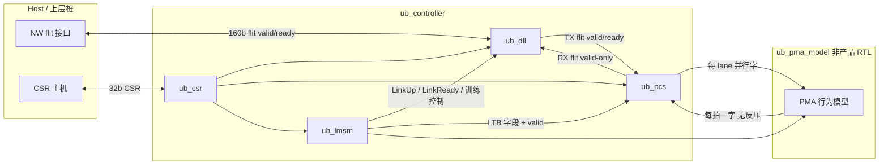
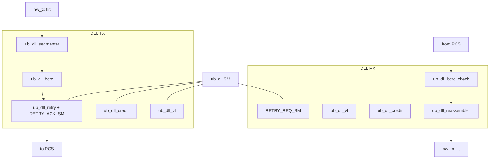
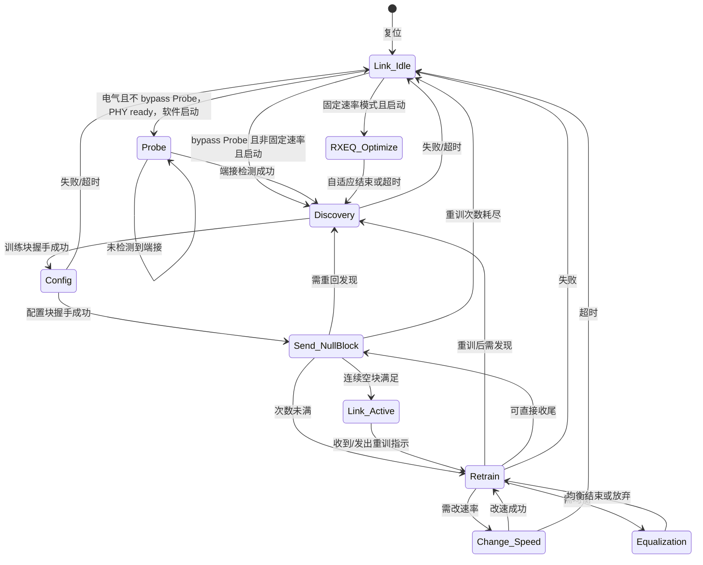
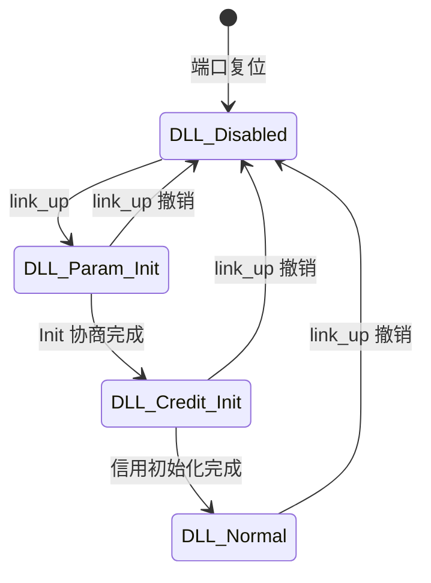

# Vibe-UB M1 功能规格

| 项 | 值 |
| --- | --- |
| 文档状态 | 草案 |
| 适用范围 | M1：开源 UnifiedBus（UB，灵衢）控制器的 PHY/PCS/PMA 模型边界 / LMSM / DLL |
| 规范基线 | UB Base Specification Rev 2.0（2025-12-31），见 [DECISIONS.md](DECISIONS.md) D1 |
| 阶段范围 | [SPEC_INDEX.md](SPEC_INDEX.md) phase 1：第 3 章 PHY/PCS/PMA/LMSM，第 4 章 DLL，附录 D 寄存器子集 |
| 实现语言 | 产品 RTL 一律由 pyCircuit（pyc4.0）生成，见 [CODING_STYLE.md](CODING_STYLE.md)、D5/D6 |
| 配套寄存器 | [REGMAP.md](REGMAP.md) |

职责与流程见 [TEAM.md](TEAM.md)、[PROCESS.md](PROCESS.md)。

**引用约定：** 本仓库不收录规范正文、表格、图或寄存器字段说明。行为以节号引用（例如「见 UB-PHY §3.2.2.3」）；需要落到设计时，只用自己的短句转述。完整规范须从 [unifiedbus.com](https://www.unifiedbus.com) 取得，并遵守 UB Specification License Agreement。

**未知 / 待定 / 草案：** 未决事项写「未知」或「待定」，不编造。§9 的 M1 默认参数已由船长确认（关闭 D14 中该项）；工艺节点仍为「未知，待船长定」。其余未决项见 §13。

**现有 `rtl/`：** 仅作参考，将按 D10 迁入 `legacy/` 后重写。本规格与现网 RTL 的已知冲突见 §12。

---

## 1. 范围与非目标

### 1.1 M1 范围（目标）

M1 实现一条 **单端口** UB 链路控制器的数字部分，使上层（M1 用 Network Layer 桩）能在链路训练完成后，按 flit 收发、按 VL 流控、按 CRC/FEC 触发重传。

| 块 | M1 做什么 | 规范锚点 |
| --- | --- | --- |
| PMA 模型边界 | 行为模型，不进产品 RTL（D3）。Gray / 预编码 / 串并转换 / CDR 在模型侧 | UB-PHY §3.3、§3.3.1、§3.3.2 |
| PCS | FEC、加扰/解扰、按 **8-bit 符号** 分发与回收、AMCTL 插入/锁定/deskew | UB-PHY §3.2 |
| LMSM | 链路训练与恢复（电气、Mode-2、Data Rate 0 为 M1 默认） | UB-PHY §3.4、§3.4.3 |
| DLL | DLL 状态机、DLLCB/DLLDP、VL、信用、重传、Init Block 协商 | UB-DL §4.2–§4.8 |
| 寄存器 | 附录 D **端口/链路子集** + M1 本地控制/状态/计数/参数读回 + 测试窗 | UB-spec App. D；[REGMAP.md](REGMAP.md) |
| 两套网表 | Python 生成期展开 `TEST_HOOKS`，PRODUCT 与 HOOKS | §11；[CODING_STYLE.md](CODING_STYLE.md) §1 |
| CDC | 业务逻辑同步复位；跨时钟只走白名单单元（D6） | 见 §4 |

M1 默认参数（船长已确认，出处见 §9）：

- PHY Mode-2，速率 Data Rate 0：2.578125 Gbit/s NRZ
- lane：bring-up 从 x1 做到 x4；RTL 参数化到 x8
- 非对称 lane 数：规范允许，M1 **默认关**；TX/RX lane 数仍各自参数化
- FEC：RS(128,120,T=4) 默认；T=2 / bypass 可协商
- VL：2（VL0+VL1），参数上限 16
- 重传缓冲：256 flit
- 信用：1 flit/cell，credit/ACK 粒度 32，独占模式，每 VL INIT 640 cell

### 1.2 非目标（M1 不做）

| 非目标 | 依据 |
| --- | --- |
| 第 5 章 Network Layer 及之后（TP/TA/FUN/MEM/RSC/SEC） | D2；SPEC_INDEX deferred |
| 规范可选特性（D4）：不把「可选」当成 M1 必做 | D4 |
| M1 多时钟域（独立 `pma_clk`） | 架构已定：单时钟；见 §4.1 |
| 真实 SerDes / PMA 模拟电路 | D3 |
| FPGA 原型 | D11 |
| 多端口、路由表、Entity / CFG1、热插拔、光模块管理、眼图监测 | App. D 中与 NW/设备管理相关的切片；UB-PHY 光互连细节 |
| QDLWS、运行中快速降宽、速率爬升到 25.78125G / PAM4 | UB-PHY §3.4.2.3、§3.4.2.4、§3.4.2.5；M1 固定 Data Rate 0 |
| 手写产品 SystemVerilog、SV-UVM、对内部信号 `force` | D5、D7、D13 |
| 把规范全文或字段表写进本仓库 | D15 |

速率不对称：规范不允许（见 UB-PHY §3.1.1、§3.4.2.5）。M1 不提供 TX/RX 不同 Data Rate。

### 1.3 与后续里程碑的边界

- M1 对上只提供 **flit + 链路状态**，不解析 Network Header。
- 附录 D 的 CFG0_BASIC 设备级字段、CFG1_*、CFG0_ROUTE_TABLE：M1 **不实现**；软件若需要完整配置空间，属后续阶段。
- 测试钩子端口与门控见 §10；验证名 `vibe_lmsm` / `vibe_dll_credit` / `vibe_pcs_tx_pack` 分别对应本规格的 `ub_lmsm`、`ub_dll_credit`、`ub_pcs` TX。

---

## 2. 框图与模块划分

### 2.1 顶层框图

PMA 模型在仿真里实例化，与 PCS 的边界是 M1 的 **PHY 数字/模型切分点**（D3）。综合网表不含 `ub_pma_model`。

### 2.2 模块职责

| 模块 | 目录（生成后） | 职责 |
| --- | --- | --- |
| `ub_controller` | `rtl/ub_controller.py` → `.v` | 顶层：例化 CSR / DLL / PCS / LMSM；PMA 模型仅 sim |
| `ub_csr` | `rtl/csr/` | 寄存器堆、译码；粘滞位 W1C；计数 RO + `CNT_CLR`；把控制打到各块 |
| `ub_dll` | `rtl/dll/` | DLL 状态机、组包/拆包、VL、信用、重传、BCRC（子块见 §2.6） |
| `ub_pcs` | `rtl/pcs/` | FEC、扰码、8-bit 符号分发、AMCTL、deskew（子块见 §2.4） |
| `ub_lmsm` | `rtl/lmsm/` | LMSM 及与 PMA 模型的训练握手 |
| `ub_pma_model` | 不进产品 `rtl/`（路径 **待定**） | Gray（仅 PAM4）、预编码、串并、探测/电气空闲的行为 |

现有 `rtl/pcs/ub_pcs_lmsm.v` 骨架不代表规范 LMSM，M1 以 §6.1 为准重写。

**参数展开为固定网表（已定）：** pycc 按参数集产出固定网表：一套参数一份模块，常量在生成期写入，模块内无 Verilog `parameter`。叶子源码自带 tag → 参数值表，`scripts/emit_rtl.py` 按表逐条生成。只有一套参数的叶子，模块名即为 `<leaf>`。上层按配置例化对应变体。

| 对象 | 约定 |
| --- | --- |
| 模块名与文件名 | `<leaf>_<tag>`。例：`ub_pcs_lane_dist_x4` / `ub_pcs_lane_dist_x8` |
| 产品网表 | `rtl/<blk>/<leaf>_<tag>.v` |
| 钩子网表 | 同名，放 `rtl/<blk>/hooks/`（§11） |

用占位值生成的网表（例如扰码抽头 / 种子仍待定，见 §13）tag 后缀 `_placeholder`，供 lint / TB 使用；PRODUCT 只收录已闭合参数的变体。是否提交占位变体由 PM 定。

### 2.3 PMA 模型边界

PCS 交给 PMA 的是 **已按 8-bit 符号分发到各 lane 的并行比特**（见 UB-PHY §3.2.2.3、§3.2.5）。下列功能 **不在 PCS**：

| 功能 | 放哪 | 说明 |
| --- | --- | --- |
| Gray 编码/解码 | PMA 模型 | 见 UB-PHY §3.3、§3.3.1。现有 RTL 放在 PCS，M1 纠正 |
| 预编码/解预编码 | PMA 模型 | 见 UB-PHY §3.3.2 |
| 串并转换、CDR、均衡模拟 | PMA 模型 | 见 UB-PHY §3.3。M1 模型深度 **待定** |
| Probe 脉冲与远端端接检测 | PMA 模型 + LMSM | 见 UB-PHY §3.4.3.2。检测算法 **未知**（实现相关） |

M1 默认 NRZ Data Rate 0：Gray **不启用**（Gray 针对 PAM4）。预编码默认 **关**（已定）。ASIC 范围已确认：只做 PCS + DLL 数字；PMA 为行为模型（D3）。

### 2.4 PCS

TX 处理顺序以 UB-PHY §3.2.1–§3.2.2 为准，**不以** 现有 `rtl/ub_controller_tx.v` 的「先扰码再 FEC、再 Gray、再按 2-bit 分 lane」为准。

M1 PCS 子块：

| 子块 | 方向 | 行为（短述） | 节号 |
| --- | --- | --- | --- |
| `ub_pcs_fec_enc` / `ub_pcs_fec_dec` | TX/RX | RS(128,120)，T=4 默认；T=2 / bypass 可协商 | §3.2.2.1、§3.2.3.5 |
| `ub_pcs_scrambler` / `ub_pcs_descrambler` | TX/RX | 每 lane 加法 PRBS23；见下 | §3.2.2.4、§3.2.3.2、§3.2.6 |
| `ub_pcs_lane_dist` / `ub_pcs_lane_dedist` | TX/RX | **8-bit FEC 符号** 跨 lane 分发/回收，不是 2-bit | §3.2.2.3、§3.2.5 |
| `ub_pcs_amctl_tx` / `ub_pcs_amctl_rx` | TX/RX | AMCTL 插入、锁定、滑窗、确认 | §3.2.4、§3.2.3.1 |
| `ub_pcs_deskew` | RX | 多 lane 对齐 | §3.2.3.1 |
| 交织/解交织 | TX/RX | 仅当 FEC 交织（CodecNum=2）开启；M1 默认 **待定**（建议 CodecNum=1） | §3.2.2.3、§3.2.3.4、§3.2.3.6 |

**加扰 / 解扰（已定规则）：** 每物理 lane 一套加法扰码，TX 与 RX 规则相同（UB-PHY §3.2.2.4、§3.2.3.2）。多项式族为 **PRBS23**（§3.2.6：低功耗 PRBS23 与加扰同一多项式）。状态寄存器 **23 bit**。生成多项式的具体抽头：规范未给出，**待定**（§13）。

种子来源是 **AMCTL 携带的 lane ID**（`AMCTL.LID`，§3.2.2.4、§3.2.4.2），不是物理 lane 序号，也不是 LTB.Lane_ID。`AMCTL.LID` → 23-bit 初值的位映射、以及 `NULL` LID 用何种种子：规范未给表，**待定**（§13）。上电后、第一次按 LID 装载之前的 LFSR 初值：**待定**。

每个被加扰符号：**LSB 先、MSB 后**（§3.2.2.4）。**不加扰：** EEIB、AMCTL。**加扰：** LTB 全部符号、以及来自 DLL 的全部数据（含 Null Block 等 DLL 码流）（§3.2.2.4、§3.2.3.2）。

种子复位（TX/RX 相同，§3.2.2.4，状态见 §3.4.3.6、§3.4.3.7）：LMSM **不在** `Send_NullBlock` / `Link_Active` 时，遇 AMCTL with EDF → 复位种子。LMSM **处于** 这两态时，遇 AMCTL with SDF → **不**复位。

M1 数据通路：每 lane `PMA_W=32`。每个 `ub_pcs_scrambler` / `ub_pcs_descrambler` 实例服务 **一条** 物理 lane；数据口 32 bit；23-bit 状态每拍步进 32 个扰码比特，`data[0]` 对应该拍第一个（LSB-first）比特。

叶子口（相对该实例）：

| 信号 | 方向 | 宽度 | 含义 |
| --- | --- | --- | --- |
| `amctl_lid` | in | 4 | 已解码的 `AMCTL.LID` 身份，不是 eBCH 码字。0–7 = Lane0–Lane7；8 = `NULL`；9–15 保留（驱动方永不驱动，TB assert）。合法身份集合见 §3.2.4.2 |
| `seed_load` | in | 1 | 按当前 `amctl_lid` 装载种子（映射表待定）。父级在上述 EDF 复位条件为真时置位 |
| `en` | in | 1 | 0：本拍旁路、LFSR 不步进（AMCTL / EEIB）。1：加扰/解扰并步进 |

### 2.5 LMSM（链路训练）

独立模块 `ub_lmsm`，不塞进 PCS 数据通路。它读 CSR 目标宽度/速率，驱 PMA 模型与 PCS 训练图案（LMB/LTB、AMCTL），向 DLL 输出 `link_up` / `link_ready`（见 UB-PHY §3.4、§3.4.3）。状态见 §6.1。

### 2.6 DLL（VL / 信用 / 重传）

| 子块 | 行为（短述） | 节号 |
| --- | --- | --- |
| `ub_dll` SM | Disabled → Param_Init → Credit_Init → Normal；`link_up==0` 回到 Disabled | UB-DL §4.2 |
| `ub_dll_segmenter` / `ub_dll_reassembler` | DLLDP 分段为 DLLDB（最大 32 flit/段），DLLCB 收发 | §4.3 |
| `ub_dll_vl` | 每链路最多 16 VL；M1 启用 VL0+VL1；VL0 必须开 | §4.5、§4.5.1、§4.5.2 |
| `ub_dll_credit` | 独占模式；cell=1 flit；归还/ACK 粒度 32 | §4.6、§4.6.1.2 |
| `ub_dll_retry` | 重传缓冲、RETRY_REQ_SM、RETRY_ACK_SM | §4.7、§4.7.3 |
| `ub_dll_bcrc` / `ub_dll_bcrc_check` | CRC 模式 BCRC；与 FEC 成败共同决定是否重传 | §4.3.2.2.4、§4.7.2 |

**BCRC（已定）：** CRC 模式每个 DLLDB 的末 flit 带 32-bit BCRC（UB-DL §4.3.2.2.4、§4.7.2）。

- CRC30 多项式：`x^30 + x^28 + x^26 + x^24 + x^23 + x^21 + x^19 + x^16 + x^14 + x^11 + x^9 + x^7 + x^6 + x^4 + x^2 + 1`（§4.7.2）。30-bit 抽头掩码 `30'h15A94AD5`（`x^30` 隐式）。
- 初值：全 1。
- 余数不取反、不重排（与 CRC30 字段同位序）。
- 输入位序：从该 DLLDB 的 Byte 0 起，每字节 **MSB 先**（§4.7.2）。
- 覆盖：该 DLLDB 内 **CRC30 字段之前** 的全部数据。
- 32-bit 打包：bit31 = 保留（发 0、收忽略）；bit30 = `ERROR_FLAG`；bit[29:0] = CRC30（§4.3.2.2.4、§4.7.2）。非 CRC 模式改用 END.`ERROR_FLAG`（§4.8.3；M1 走 CRC 模式，用 BCRC）。

`ub_dll_bcrc` / `ub_dll_bcrc_check` 按 `FLIT_W=160` 流式计算，1 拍给出 `crc_word` / 比较结果。检查口只比对 30-bit CRC30；`ERROR_FLAG` 不参与 CRC 符合性。

Init Block 字段名只作标识符使用，位定义见 UB-DL §4.3.3.9，本仓库不抄表。协商流程见 §4.4。

---

## 3. 顶层与模块间接口

### 3.1 握手通则

**valid/ready 流**（下表标「valid/ready」）：

1. **同一拍** `valid==1 && ready==1` 才完成一次传送。
2. `valid==1` 时数据与边带必须保持，直到 `ready==1`。
3. `ready` 不得组合依赖于本拍的 `valid`（避免组合环）。允许 `valid` 组合看 `ready`。
4. 复位撤销后，`valid` 与 `ready` 的首拍值：**待定**（建议 `valid=0`，`ready` 在下游能收时为 1）。
5. 无握手的旁路线是电平，不是脉冲。

**valid-only 流**（下表标「valid-only」）：无 `ready`。源每拍可给 `valid`；宿 **必须收下** 该拍。M1 用于 PMA→PCS 与 PCS→DLL RX。DLL 内部 RX 缓冲深度 **待定**（§13）。

CSR 用独立的 req/ready，见 §3.2.3。

### 3.2 顶层端口 `ub_controller`

时钟域列 `core_clk` 表示 M1 **唯一**时钟域（见 §4）。宽度中的参数见 §9。无 `pma_clk` / `pma_rst_n` 端口。

#### 3.2.1 时钟复位

| 端口 | 方向 | 宽度 | 时钟域 | 含义 |
| --- | --- | --- | --- | --- |
| `core_clk` | in | 1 | — | 唯一时钟。等于 PMA 并行字时钟：2.578125 Gb/s / 32 bit ≈ **80.57 MHz** |
| `rst_n` | in | 1 | 异步输入 | 低有效。异步置位、经白名单同步器同步释放；下游见 §4.2 |

#### 3.2.2 上层 flit（替代 Network Layer）

Flit 宽度 160 bit 来自项目既有设计说明与 Xia 重传公式（160b），与 UB flit 概念对齐。边带为项目接口，不是规范抄录。

| 端口 | 方向 | 宽度 | 时钟域 | 含义 |
| --- | --- | --- | --- | --- |
| `nw_tx_data` | in | 160 | `core_clk` | 上层要发送的 flit 净荷（不含 LPH/LBH/BCRC） |
| `nw_tx_valid` | in | 1 | `core_clk` | TX valid |
| `nw_tx_ready` | out | 1 | `core_clk` | DLL 可收。无信用、未 `dll_status_up`、或重传占用时可为 0 |
| `nw_tx_sop` | in | 1 | `core_clk` | DLLDP 首 flit |
| `nw_tx_eop` | in | 1 | `core_clk` | DLLDP 末 flit |
| `nw_tx_vl` | in | 4 | `core_clk` | VL ID。未使能的 VL（M1 合法为 0–1）：整包丢弃，计数 +1，置位粘滞状态（见 §7） |
| `nw_rx_data` | out | 160 | `core_clk` | 投递给上层的 flit 净荷 |
| `nw_rx_valid` | out | 1 | `core_clk` | RX valid |
| `nw_rx_ready` | in | 1 | `core_clk` | 上层可收。DLL 必须能反压；RX 缓冲深度 **待定** |
| `nw_rx_sop` | out | 1 | `core_clk` | 重组后 DLLDP 首 flit |
| `nw_rx_eop` | out | 1 | `core_clk` | 重组后 DLLDP 末 flit |
| `nw_rx_vl` | out | 4 | `core_clk` | 该包 VL |
| `nw_rx_err` | out | 1 | `core_clk` | 与该 DLLDP 末 flit（`nw_rx_eop`）对齐：本包 `ERROR_FLAG`（见 §7）。`valid==0` 时忽略 |
| `dll_status_up` | out | 1 | `core_clk` | 可向对端发 DLLDP（见 UB-DL §4.2 对上层状态） |
| `dll_status_down` | out | 1 | `core_clk` | 与 `dll_status_up` 互斥 |

单 flit 包：同一拍 `sop==1 && eop==1` 合法。`valid==0` 时 sop/eop/vl/data **忽略**。

#### 3.2.3 CSR

| 端口 | 方向 | 宽度 | 时钟域 | 含义 |
| --- | --- | --- | --- | --- |
| `csr_req` | in | 1 | `core_clk` | 本拍有一次访问 |
| `csr_wr` | in | 1 | `core_clk` | 1=写，0=读 |
| `csr_addr` | in | 16 | `core_clk` | 字节地址，须 4 字节对齐 |
| `csr_wdata` | in | 32 | `core_clk` | 写数据。**仅 32-bit 整字写**，无 `csr_wstrb` |
| `csr_ready` | out | 1 | `core_clk` | 当拍接受 `csr_req`。M1 恒 1（无等待） |
| `csr_rvalid` | out | 1 | `core_clk` | 读响应：请求的 **下一拍** 为 1（固定 1 拍延迟） |
| `csr_rdata` | out | 32 | `core_clk` | 与 `csr_rvalid` 同拍。未映射读回 0 |
| `csr_err` | out | 1 | `core_clk` | 与响应同拍（请求的下一拍）。未映射：读回 0 且本位置 1；写忽略且本位置 1 |

无 `csr_wstrb`。未对齐地址按未映射处理。写响应：下一拍 `csr_rvalid=0`，`csr_err` 有效。

**TEST 窗（`0x0300`–`0x03FF`）：** 地址 **已映射**。`tb_test_mode=0` 时（以及 PRODUCT 网表 `TEST_HOOKS=0` 时）读回 0、写忽略、**`csr_err=0`**。这样 PRODUCT 与 HOOKS（`tb_test_mode=0`）对等价检查行为相同，见 §11 (d)。

**清除语义（已定，与 [REGMAP.md](REGMAP.md) 一致）：** 禁止读清，禁止「RW 写任意值清零」。粘滞状态为 **W1C**。计数器为 **RO**、饱和到全 1，写 `CNT_CLR` 对应位为 1 清零（`CNT_CLR` 为 WO、写后自清）。

**`PORT_RST`（已定）：** WO、写 1 自清。产生内部 **16 拍** `core_clk` 复位脉冲，复位 PCS、LMSM、DLL（含重传状态）和信用计数。**不**复位 CSR 配置寄存器、错误计数、IRQ（status/mask）、TEST 寄存器（保留便于事后分析）。

#### 3.2.4 PCS–PMA 数据（模型边界）

`PMA_W = 32`（已确认）。`NUM_LANES_TX` / `NUM_LANES_RX` 见 §9。

| 端口 | 方向 | 宽度 | 时钟域 | 含义 |
| --- | --- | --- | --- | --- |
| `pma_tx_data` | out | `NUM_LANES_TX*PMA_W` | `core_clk` | 每 lane 并行字，lane0 在 LSB |
| `pma_tx_valid` | out | 1 | `core_clk` | 本拍字有效。训练期由 LMSM/PCS 出图案 |
| `pma_tx_ready` | in | 1 | `core_clk` | 模型常就绪时恒 1 |
| `pma_tx_elec_idle` | out | `NUM_LANES_TX` | `core_clk` | 每 lane 电气空闲请求 |
| `pma_rx_data` | in | `NUM_LANES_RX*PMA_W` | `core_clk` | 每 lane 并行字（模型已完成串并；PAM4 时已 Gray 反变换） |
| `pma_rx_valid` | in | 1 | `core_clk` | RX 字有效。单时钟下 PMA **每拍一字**；无 `pma_rx_ready`，PCS 不得反压 PMA |
| `pma_rx_data_valid_lane` | in | `NUM_LANES_RX` | `core_clk` | **待定**。是否需要 per-lane valid（deskew 前） |

PMA 字内位序见 §3.3。AMCTL 与数据字是否共用 `pma_tx_data`：**待定**（建议共用，由 PCS 在数据流里插 AMCTL，见 UB-PHY §3.2.4）。

#### 3.2.5 LMSM–PMA 训练侧带

| 端口 | 方向 | 宽度 | 时钟域 | 含义 |
| --- | --- | --- | --- | --- |
| `pma_data_rate_sel` | out | 4 | `core_clk` | 目标/当前 Data Rate 编号。M1 只用 0 |
| `pma_tx_width` | out | 4 | `core_clk` | 激活的 TX lane 数编码。编码表 **待定** |
| `pma_rx_width` | out | 4 | `core_clk` | 激活的 RX lane 数编码 |
| `pma_lane_reverse_tx` | out | 1 | `core_clk` | TX lane 反转（见 UB-PHY §3.4.2.7） |
| `pma_lane_reverse_rx` | out | 1 | `core_clk` | RX lane 反转 |
| `pma_polarity_inv` | out | `NUM_LANES_RX` | `core_clk` | 极性翻转（§3.4.2.6）。每 bit 对应一 lane |
| `pma_probe_pulse_en` | out | 1 | `core_clk` | 请求模型发探测脉冲 |
| `pma_term_detect` | in | `NUM_LANES_TX` | `core_clk` | 模型报告远端端接 |
| `pma_rx_eidle_exit` | in | `NUM_LANES_RX` | `core_clk` | RX 退出电气空闲（电平，不是脉冲） |
| `pma_phy_ready` | in | 1 | `core_clk` | 模型就绪 |

均衡系数、FEC 模式旁路到 PMA 的其它针脚：**未知**（M1 Data Rate 0 / NRZ 可能用不到）。需要时只加电平信号，不加脉冲。

#### 3.2.6 对外状态

| 端口 | 方向 | 宽度 | 时钟域 | 含义 |
| --- | --- | --- | --- | --- |
| `link_up` | out | 1 | `core_clk` | LMSM 置位，DLL 用来离开 Disabled（§3.4.3、§4.2） |
| `link_ready` | out | 1 | `core_clk` | 物理层可承载业务（§3.4.3.7） |
| `irq` | out | 1 | `core_clk` | 高有效电平。任一未屏蔽源为 1。复位后 **全部源屏蔽**（见 REGMAP `IRQ_MASK`） |

测试钩子：顶层另有 `tb_test_mode` 与 `tb_inj_*` / `tb_obs_*`，见 §10。`TEST_HOOKS=0` 时这些端口不存在。

### 3.3 模块间接口

均在 `core_clk`，同步复位后的业务域。宽度随参数变。

**位序（项目约定，已定）：** PMA 字内 **符号 0 占最低字节**；符号内 **bit0 为 LSB**（对照 UB-PHY §3.2.5.1 NRZ 位序、§3.2.5.3 / §3.4.1 的 LMB 符号序）。多 lane 打包：lane0 在总线 LSB（§3.2.4）。加扰步进的「符号 LSB 先」与此同一套 LSB。

#### 3.3.1 DLL ↔ PCS（TX）

| 信号 | 方向（相对 DLL） | 宽度 | 含义 |
| --- | --- | --- | --- |
| `dll2pcs_data` | out | 160 | 已带 LPH/LBH/BCRC 的 flit，或 DLLCB flit |
| `dll2pcs_valid` | out | 1 | valid |
| `dll2pcs_ready` | in | 1 | PCS 可收（FEC 组帧会反压） |
| `dll2pcs_is_cb` | out | 1 | 1=DLLCB，0=DLLDP。PCS 不解析内容，只当数据 |
| `dll2pcs_sop` / `dll2pcs_eop` | out | 1 | 块/包边界。PCS 是否需要：**待定**（FEC 组帧可能只按字节流） |

#### 3.3.2 PCS ↔ DLL（RX，valid-only）

无 `pcs2dll_ready`。DLL **必须收下每一拍** `pcs2dll_valid`。DLL 内部 RX 缓冲深度 **待定**（§13）。

| 信号 | 方向（相对 PCS） | 宽度 | 含义 |
| --- | --- | --- | --- |
| `pcs2dll_data` | out | 160 | 解扰后的 flit |
| `pcs2dll_valid` | out | 1 | 本拍 flit 有效（valid-only） |
| `pcs2dll_fec_ok` | out | 1 | 本 flit 所属 FEC 码字可纠正或无错 |
| `pcs2dll_fec_uncorr` | out | 1 | 本码字不可纠正。与 `fec_ok` 互斥 |
| `pcs2dll_bypass` | out | 1 | 当前为 FEC bypass。此时 `fec_ok` 含义 **待定** |

`fec_ok` / `fec_uncorr` 必须与对应 flit 对齐（同一拍）。跨 FEC 码字的延迟由 PCS 内部对齐，不把「后到的成败」单独用脉冲送给 DLL。

#### 3.3.3 LMSM ↔ DLL

| 信号 | 方向（相对 LMSM） | 宽度 | 含义 |
| --- | --- | --- | --- |
| `link_up` | out | 1 | 见 §3.2.6 |
| `link_ready` | out | 1 | 见 §3.2.6 |
| `dll_retrain_req` | in | 1 | DLL 请求物理层重训（RETRY_REQ_SM 进 RETRAIN，见 UB-DL §4.7.3.3） |
| `lmsm_retrain_ack` | out | 1 | 电平：LMSM 已进入 Retrain。禁止用脉冲 |

#### 3.3.4 LMSM ↔ PCS（含 LTB/CLTB 字段口）

LMB 为 16 个 8-bit 符号（见 UB-PHY §3.4.1）。种类：LTB、EEIB（§3.4.1.2）。LTB 再分为 DLTB / CLTB / RLTB / ELTB（§3.4.1.1）。

**拼装分工（已定）：** LMSM 给出各 lane **相同**的公共字段（UB-PHY §3.4.1「identical LMBs」适用于 Lane_ID **以外**的字段）。PCS 按模式为 **每个物理 TX lane** 填 Lane_ID，然后 **按 lane** 算 CRC（符号 12–13）和 padding（符号 14–15），再插入码流（§3.2.4、§3.4.1）。Lane_ID 规则见 UB-PHY §3.4.2（如 Discovery.Active：DLTB.Lane_ID = 当前物理 lane；Config：各 lane 编号唯一、沿 Tx_0..Tx_M-1 递增，或该状态要求的 NULL）。

**TX 采样时序（已定）：** PCS 在 **每一帧即将插入的 LMB 起始边界** 锁存全部 `lmsm2pcs_*` LTB/CLTB 字段、`lmsm2pcs_pattern`、以及下列 Lane_ID 控制口。LMSM **任意拍** 都可改这些信号；改动从 **下一帧 LMB 起始** 生效。`lmsm2pcs_ltb_valid` **没有** 多拍保持要求。

**RX valid：** PCS 仅在 LTB CRC 通过时给出 `pcs2lmsm_ltb_valid` **单拍**；无 ready，LMSM 当拍采样。CRC 失败不产生 valid。`lmsm2pcs_pattern==EEIB` 时 PCS 按当前 Data Rate 生成 EEIB（§3.4.1.2），不用 LTB 字段。

**图案、锁定、Lane_ID 控制（TX 无 `lmsm2pcs_lane_id`）：**

| 信号 | 方向（相对 LMSM） | 宽度 | 含义 |
| --- | --- | --- | --- |
| `lmsm2pcs_pattern` | out | 2 | 0=电气空闲，1=EEIB，2=LTB（用字段口），3=DLL 业务码流 |
| `lmsm2pcs_ltb_valid` | out | 1 | 与字段一并在 LMB 起始锁存。无多拍稳定要求 |
| `lmsm2pcs_lane_id_mode` | out | 2 | 0=`PHYS`：该物理 TX lane 编号写入 Lane_ID（§3.4.2 Discovery.Active）。1=`ASCEND`：用 `lane_id_map` / `lane_id_base`（§3.4.2 Config）。2=`NULL`：写入该状态要求的空值（取值见 §3.4.1.1）。3=`RESERVED`：LMSM 永不驱动（TB assert）。PCS 与 2 走同一分支，按 NULL 解码；无不可达分支、无需 waiver |
| `lmsm2pcs_lane_id_base` | out | 8 | `ASCEND` 时逻辑 Tx_0 的 Lane_ID；`PHYS`/`NULL` 忽略 |
| `lmsm2pcs_lane_id_map` | out | `8*NUM_LANES_TX` | `ASCEND` 时每物理 TX lane 一字节：该 lane 的 Lane_ID（唯一递增 Tx_0..Tx_M-1，或该 lane 为 NULL）。字节 i 对应物理 TX lane i。`PHYS`/`NULL` 忽略 |
| `pcs2lmsm_ltb_valid` | in | 1 | RX 收到一帧 CRC 通过的 LTB（单拍） |
| `pcs_am_locked` | in | `NLANE` | 每 lane AM/AMCTL 锁定。可被 `tb_inj_am_lock` 旁路，不回灌 PCS |
| `pcs_lid_bad` | in | 1 | 训练所见 Link_ID 非法/不一致。可被 `tb_inj_lid_bad` 旁路，不回灌 PCS |
| `pcs_deskew_ok` | in | 1 | deskew 完成 |

`ASCEND`：PCS 把物理 lane i 的 Lane_ID 取自 `lmsm2pcs_lane_id_map` 对应字节；`lmsm2pcs_lane_id_base` 等于逻辑 Tx_0 那一字节，供对照。`PHYS`：PCS 写物理 lane 号，不用 map/base。`NULL`（mode=2 或 3）：各激活 lane 的 Lane_ID 均为 §3.4.1.1 的空值。

**LTB 字段口**（TX 前缀 `lmsm2pcs_`，RX 前缀 `pcs2lmsm_`；同名同宽。标识符取自 §3.4.1.1，宽度为字段位宽，不含保留位。Type / 宽度编码等枚举值实现时对照该节，不在此抄表。）

| 字段端口（去前缀） | 宽度 | 用于 | 节号 |
| --- | --- | --- | --- |
| `ltb_type` | 8 | 全部 LTB。DLTB/CLTB/RLTB/ELTB 的 Type | §3.4.1.1 |
| `link_id` | 8 | DLTB、CLTB 的 Link_ID | §3.4.1.1 |
| `lane_id` | 8 | **仅 RX**（`pcs2lmsm_lane_id`）：该次 valid 对应 LMB 里的 Lane_ID。TX 由 PCS 按 `lane_id_mode`/`map`/`base` 填写，无 `lmsm2pcs_lane_id` | §3.4.1.1、§3.4.2 |
| `tlw` | 6 | DLTB、CLTB 的 TX Link Width | §3.4.1.1 |
| `rlw` | 6 | DLTB、CLTB 的 RX Link Width | §3.4.1.1 |
| `data_rate_support_1` | 8 | DLTB、RLTB 的 Data_Rate_Support_1 | §3.4.1.1 |
| `data_rate_support_2` | 8 | DLTB、RLTB 的 Data_Rate_Support_2（含 Change_Speed 位，RLTB） | §3.4.1.1 |
| `fec_mode_support` | 8 | DLTB 的 FEC_Mode_Support | §3.4.1.1 |
| `port_type` | 1 | DLTB 的 Port_Type | §3.4.1.1 |
| `portnego_random_value` | 7 | DLTB 的 PortNego_Random_Value | §3.4.1.1 |
| `fec_interleave_support` | 4 | DLTB 的 FEC_Interleave_Support | §3.4.1.1 |
| `rx_lane0_id` | 3 | DLTB 的 RX_Lane0_ID | §3.4.1.1 |
| `max_link_width` | 3 | DLTB 的 MAX_LINK_WIDTH | §3.4.1.1 |
| `eq_mode` | 2 | CLTB 的 EQ_Mode | §3.4.1.1 |
| `fec_mode_ctrl` | 3 | CLTB、RLTB 的 FEC_Mode_Ctrl。PCS 数据通路 FEC 模式跟此字段，不再另设 2-bit `pcs_fec_mode` | §3.4.1.1 |
| `fec_interleave_ctrl` | 1 | CLTB 的 FEC_Interleave_Ctrl | §3.4.1.1 |
| `eq_ctrl1` | 6 | RLTB / ELTB 的 EQ_Ctrl1 有效位 | §3.4.1.1 |
| `eq_ctrl2` | 8 | RLTB / ELTB 的 EQ_Ctrl2 | §3.4.1.1 |
| `eq_ctrl3` | 8 | RLTB / ELTB 的 EQ_Ctrl3 | §3.4.1.1 |
| `eq_ctrl4` | 8 | ELTB 的 EQ_Ctrl4 | §3.4.1.1 |
| `fec_crc_mode_reject` | 1 | RLTB | §3.4.1.1 |
| `pre_fec_ber_meas_st` | 2 | RLTB 的 Pre-FEC_BER_Measurement_Status | §3.4.1.1 |
| `fec_interleave_enable` | 1 | RLTB | §3.4.1.1 |
| `fec_interleave_ctrl_reject` | 1 | RLTB | §3.4.1.1 |
| `request_equalization` | 1 | RLTB 的 Link_Ctrl.Request_Equalization | §3.4.1.1 |
| `crc_mode_ctrl` | 3 | RLTB 的 CRC_Mode_Ctrl | §3.4.1.1 |
| `local_tx_preset` | 4 | RLTB 的 Local_TX_Preset | §3.4.1.1 |
| `first_pre_cursor` | 6 | RLTB / ELTB（PAM4 时有意义） | §3.4.1.1 |
| `eq_reject` | 1 | ELTB 的 EQ_Reject | §3.4.1.1 |
| `current_eq_phase` | 2 | ELTB 的 Current_EQ_Phase | §3.4.1.1 |
| `preset_mode_en` | 1 | ELTB 的 Preset_Mode_En | §3.4.1.1 |
| `tx_preset` | 4 | ELTB 的 TX_Preset | §3.4.1.1 |

未作为独立端口的：CRCL/CRCH、padding、各符号保留位（PCS 发 0、收忽略，§3.4.1.1）。EEIB 符号图案由 PCS 按速率生成，无字段口。

本拍未使用的字段（例如发 CLTB 时的 RLTB 专用位）TX 填 0，RX 忽略。

#### 3.3.5 CSR → 各块

CSR 输出均为 `core_clk` 电平寄存器，不握手。各块输出的计数/状态为同步采样。跨模块禁止用「写 CSR 产生的单拍脉冲」穿过可能的时钟域；M1 单时钟下可用同步 1 拍选通，但选通不得送出 `core_clk` 域。

---

## 4. 时钟与复位

### 4.1 M1 单时钟域（已定）

M1 **只有** `core_clk`。它就是 PMA 并行字时钟：

`F_CORE = 2.578125 Gb/s / 32 bit ≈ 80.57 MHz`

- 无独立 `pma_clk`。`USE_PMA_CLK=0` **已定**（不是草案）。
- 多时钟是 M1 **非目标**。产品通路不做 CDC。
- PMA 模型与 PCS 同拍于 `core_clk`。xN 时接口宽度 `N*32`，无需跨时钟齿轮箱。
- 工艺节点仍为 **未知，待船长定**。`F_CORE` 已按上式确定。

pyc4.0 的 CDC 原语仍只允许按 §4.3 使用；M1 生成网表中不应出现跨时钟 FIFO。后续里程碑若引入第二时钟，再开新决策，不在 M1 预留 `pma_clk` 端口。

### 4.2 复位（已定）

| 规则 | 说明 |
| --- | --- |
| 顶层端口 | `rst_n`，低有效 |
| 置位 / 释放 | **异步置位、同步释放**，只允许经白名单复位同步器（见 [CODING_STYLE.md](CODING_STYLE.md)） |
| 业务逻辑 | **同步复位**（D6）。`always` 只对 `posedge core_clk` 敏感 |
| 极性对接 | 同步器之后用封装把复位接到 `pyc_reg` 的 **原生极性**（见下） |
| Entity vs 端口复位 | 规范区分二者（UB-DL §4.2）。M1 无 Entity：顶层 `rst_n` 复位全部（含 CSR）。CSR `PORT_RST` 只脉冲复位数据通路，见 §3.2.3 |

**封装（唯一对接点）：**

1. 白名单单元 `ub_rst_sync`：**2 级**触发器。输入异步 `rst_n` + `core_clk`，输出 `rst_n_sync`（仍低有效；异步置位、同步释放）。
2. 生成逻辑封装 `ub_pyc_rst_adapt`：把 `rst_n_sync` 转成 `rst_pyc`，极性等于 **pyc4.0 `pyc_reg` 原生极性**。若库原生已是低有效，本封装退化为连线。业务模块只看见 `rst_pyc`，不直接采样顶层 `rst_n`。

现有 `rtl/` 使用 `posedge clk or negedge rst_n`，**不合**本规格，重写时删除。

### 4.3 CDC 白名单

| 原语 | 用途 | 限制 |
| --- | --- | --- |
| 手写 `ub_rst_sync` | 2 级；异步置位、同步释放 `rst_n` → `rst_n_sync` | 仅复位；M1 只对 `core_clk` |
| `pyc_cdc_sync` | 1-bit 电平 | 禁止多 bit、禁止脉冲 |
| `pyc_async_fifo` | 多 bit 总线 | 数据通路跨时钟的唯一手段 |
| 其它手写 CDC | 禁止 | 无 pulse/req-ack 原语可用，故接口不得依赖它们 |

---

## 5. 时序

均为 **目标**，不是已关门的约束。具体拍数在 pyCircuit 实现后回填；未测写「待定」。

| 路径 | 目标 | 备注 |
| --- | --- | --- |
| CSR 写生效到控制电平 | 1 拍 | 同步寄存器 |
| CSR 读 | 固定 1 拍：请求下一拍 `csr_rvalid` | 见 §3.2.3；无 `csr_wstrb` |
| NW TX valid/ready | 无气泡当 `ready==1` | 信用不足时 `ready==0` |
| DLL 分段插入 LPH/LBH/BCRC | **待定** | 至少 1 拍打头、BCRC 在段末 |
| FEC 编码 | **待定** | RS(128,120) 组 120 符号；并行度 **待定** |
| FEC 解码 | **待定** | 含伴随式/关键方程/Chien |
| AMCTL 插入造成的周期气泡 | 按 §3.2.4 规则 | 间隔/长度不在此抄录 |
| PCS 组帧反压 DLL TX | 允许持续 `dll2pcs_ready==0` | 不得丢 flit |
| PMA→PCS | 每拍一字，无 `pma_rx_ready` | PCS 必须收 |
| PCS→DLL RX | valid-only，无 `pcs2dll_ready` | DLL 必须收；RX 缓冲深度待定 |
| LMSM→PCS LMB 字段 / `pattern` / Lane_ID 控制 | 每帧 LMB **起始边界**锁存 | 见 §3.3.4。LMSM 任意拍可改；下一帧 LMB 起始生效。`lmsm2pcs_ltb_valid` 无多拍稳定要求 |
| `ub_pcs_scrambler` / `ub_pcs_descrambler` | 1 拍 | 每 lane 32-bit 数据口；23-bit 状态 |
| `ub_dll_bcrc` / `ub_dll_bcrc_check` | 1 拍 | 到 `crc_word` / `done` / `crc_ok` |
| `ub_pcs_lane_dist` / `ub_pcs_lane_dedist` | 0 拍 | 组合；8-bit 符号分发 |
| 重传从 REQ 到重发首 flit | **待定** | 受 retry buffer 读口约束 |
| 信用归还从 RX 收齐到 TX 发出 | **待定** | 粒度 32（已确认） |

Data Rate 0、x1、32 bit/lane：线速率与 160-bit flit 不对齐。TX 用 valid/ready 在 DLL↔PCS 做齿轮；RX 用 valid-only，多余节拍存在 DLL RX 缓冲（深度待定）。拍数关系：**待定**（实现时按 PMA 字与 FEC 码字长度计算）。

---

## 6. 状态机

图为项目转述，不是规范附图的复制。转移条件只写设计需要的短句，细节见节号。

### 6.1 LMSM（UB-PHY §3.4.3）

主状态（标识符与规范一致）：

`Link_Idle`，`Probe`，`RXEQ_Optimize`，`Discovery`，`Config`，`Send_NullBlock`，`Link_Active`，`Retrain`，`Change_Speed`，`Equalization`

Probe / Discovery / Config / Retrain / Equalization 的子状态按对应小节实现（如 Probe.Wait / Probe.Confirm）。子状态清单以规范为准，此处不展开抄录。

M1 bring-up 裁剪（默认参数已确认）：

| 项 | M1 |
| --- | --- |
| 互联 | 电气；`bypass_Probe=0`，除非 CSR 置位 |
| 速率 | 固定 Data Rate 0；`Change_Speed` 实现状态但不改变速率，或直接视为非法请求 |
| 均衡 | Data Rate 0 下 `Equalization` / `RXEQ_Optimize` 是否空转超时退出：**待定** |
| 非对称 | 默认 Tx_M==Rx_N |
| 光学旁路 Probe/EQ | 非目标 |

`link_up` / `link_ready` 在哪些状态置位：见 UB-PHY §3.4.3.6–§3.4.3.8，不在此复制条件表。设计要求：`link_up` 为电平；DLL 只看电平，不看边沿脉冲。

软件启动 LMSM：CSR 写 `CTRL.LMSM_START`（REGMAP `0x0000` bit1）。这是实现手段，对应规范「上层指示进入下一状态」（§3.4.3.1）。

### 6.2 DLL 状态机（UB-DL §4.2）

| 状态 | 含义（短述） | 主要出口 |
| --- | --- | --- |
| `DLL_Disabled` | 复位后或 `link_up==0`。对上 `dll_status_down`。不发 DLLDP | `link_up==1` → `DLL_Param_Init` |
| `DLL_Param_Init` | 交换 Init Block，协商粒度/VL 等（§4.3.3.9、§4.4） | 协商完成且 `link_up==1` → `DLL_Credit_Init`；`link_up==0` → Disabled |
| `DLL_Credit_Init` | 按协商结果做信用初值（§4.6.1） | 信用初始化完成且 `link_up==1` → `DLL_Normal`；`link_up==0` → Disabled |
| `DLL_Normal` | 可收发 DLLDP | `link_up==0` → Disabled |

对上：仅 `DLL_Normal` 报 `dll_status_up`（见 §4.2）。Param/Credit 期间可发规定的 DLLCB，不发上层 DLLDP。

### 6.3 RETRY_REQ_SM（UB-DL §4.7.3.3）

状态：`NORMAL`，`REQ`，`WAIT`，`RETRAIN`，`ERROR`。CSR `STATUS.RETRY_REQ_ST[12:10]`（已定）：0=`NORMAL`，1=`REQ`，2=`WAIT`，3=`RETRAIN`，4=`ERROR`，5–7 保留。RTL 永不产出保留编码；TB assert。

| 从 → 到 | 条件（短述） |
| --- | --- |
| NORMAL → REQ | CRC 失败，或 FEC 不可纠正，或需重传的物理层事件 |
| REQ → WAIT | 重传请求集已发出 |
| WAIT → REQ | 等 ACK 超时 |
| WAIT → NORMAL | 收到重传应答集 |
| NORMAL 或 REQ → RETRAIN | 物理层重训，或 `NUM_RETRY` 达到阈值 |
| RETRAIN → REQ | 重训成功 |
| RETRAIN → ERROR | `NUM_PHY_REINIT` 达到阈值 |
| ERROR → NORMAL | 需 UBFM/软件复位（M1：CSR 端口复位） |

阈值默认：采用 §4.7.3.3 的推荐量级 15 与 4（**草案**，非 Xia 已确认集），并在 REGMAP 读回。实现时对照该节，不在此抄正文。

### 6.4 RETRY_ACK_SM（UB-DL §4.7.3.4）

两个状态：`NORMAL`、`ACK`（标识符见该节）。CSR `STATUS.RETRY_ACK_ST[14:13]`（已定）：0=`NORMAL`，1=`ACK`，2–3 保留。RTL 永不产出保留编码；TB assert。职责：对端请求时发应答集，并从 retry buffer 重放。转移条件等未实现细节：**待定**（按该节，不在此发明子条件）。

---

## 7. 异常与错误处理

原则：错误经 CSR 计数/状态/可选 `irq` 可见；TB 不得 `force` 内部节点，注入走端口或测试钩子（D13）。不可恢复错误停在安全态，等软件复位。

| 异常 | 检测 | 动作（短述） | 节号 |
| --- | --- | --- | --- |
| FEC 不可纠正 | PCS 解码失败 | 对齐 flit 标 `pcs2dll_fec_uncorr`；DLL 按模式触发重传；计数 +1 | UB-PHY §3.2.3.5；UB-DL §4.7.2 |
| BCRC 失败 | DLL RX | 触发 RETRY_REQ_SM；丢弃该块；计数 +1 | §4.7.2、§4.3.2.2 |
| 重传次数过多 | `NUM_RETRY` | 进 RETRAIN / 上报 | §4.7.3.3、§4.8.2 |
| 重传仍失败 | `NUM_PHY_REINIT` | 进 ERROR；停发停收；等复位 | §4.7.3.3、§4.8.2 |
| Retry ACK 超时 | WAIT 计时 | 回 REQ 或按 §4.8.2 上报 | §4.7.3.3、§4.8.2 |
| 信用为 0（正常反压） | TX credit == 0 | 停发 DLLDP，`nw_tx_ready=0`。不是错误 | UB-DL §4.6 |
| 信用下溢（计数被减到负 / 在 0 时仍减） | TX credit 记账 | RTL：计数 +1、粘滞状态、`irq` 源。**不是** RTL assertion。TB 另外 assert | proj |
| Receive Buffer Overflow | RX | 上报，链路不能继续，等复位 | §4.8.1 |
| Flow Control Overflow | 信用超过初值 | 同上 | §4.8.1 |
| 信用归还超时 | 定时器 | 上报 DL Protocol Error，等复位 | §4.8.1 |
| retry 指针/NumFreeBuf 溢出 | ACK 释放 | 上报，等复位 | §4.8.2 |
| `link_up` 变 0 | LMSM | DLL → Disabled；丢弃已从上层收下、未完成的发送。RX 若已向上层送出部分 DLLDP：剩余净荷填 0，并置 `nw_rx_err`（对应 BCRC/END.ERROR_FLAG） | §4.8.4 |
| LMSM 训练超时 | 各状态超时 | 回 Link_Idle 或 Retrain，见 §3.4.3 | §3.4.3 |
| 非法 / 未使能 VL | NW TX `nw_tx_vl` | 整包丢弃；`CNT_BAD_VL` +1；粘滞 `IRQ_STATUS.BAD_VL` | §4.5 |
| CSR 未映射地址 | 译码 | 读返回 0 且 `csr_err=1`；写忽略且 `csr_err=1`（响应在请求下一拍） | 项目约定 |

超时的具体微秒/拍数：规范有的以节号为准（例如部分 LMSM 超时在 §3.4.3.x），实现时对照，**不抄进本仓库**。规范写「实现相关」的：标 **待定**。

信用：0 信用只反压。下溢（实现把计数减过 0）才走错误计数 / 粘滞 / irq。对端少归还走超时（§4.8.1）。RTL 不对下溢做 assertion。

**`ERROR_FLAG`（已定，UB-DL §4.8.3、§4.8.4）：**

- **TX 置位：** 仅当该 DLLDP 的部分 DLLDB **已经发出** 之后，DLL 发现本包数据读错误（规范举例为存储器 ECC），在该 DLLDP **最后一个** DLLDB 的 BCRC（CRC 模式）或 END（非 CRC 模式）置 `ERROR_FLAG`。来源是 **DLL 内部**，不是上层输入；**不设** `nw_tx_err`。M1 无 ECC 存储器，此 TX 路径不触发，发往对端的 `ERROR_FLAG` **恒 0**。
- **RX：** 带该标志的 DLLDP 当正常包处理并交给上层，**不**单因该标志发起重传（链路误码仍走 FEC/BCRC 重传）。`nw_rx_data` 不含 BCRC/END，用 `nw_rx_err` 把本包 `ERROR_FLAG` 交给上层（与 `nw_rx_eop` 对齐）。
- **链路断开：** 见上表 `link_up` 变 0：已部分上送的 DLLDP 填 0 并置 `nw_rx_err`。

---

## 8. 性能与延迟目标

工艺节点：**未知，待船长定。** `core_clk` ≈ **80.57 MHz**（已定，见 §4.1）。

| 指标 | M1 目标 | 说明 |
| --- | --- | --- |
| 线速率 | 2.578125 Gbit/s NRZ / lane | 已确认 |
| 宽度 | x1 功能闭环，x4 为 bring-up 目标，RTL 到 x8 | 已确认 |
| 有效吞吐 | 扣除 FEC 8/128、AMCTL、DLL 头开销后的 flit 率 | 具体 Gbps **待定**（依赖 AMCTL 间隔与是否满信用） |
| 链路 RTT 假设 | 2 µs（算 retry 深度） | 已确认（M1）；spec-max 档按 1 µs |
| NW 口到 PMA 口 TX 延迟 | **待定** | 实现后回填拍数 |
| PMA 口到 NW 口 RX 延迟 | **待定** | 含 FEC 解码，预期占主导 |
| 重传恢复 | 在 RTT 假设内不饿死 retry 深度 | 深度公式见 UB-DL §4.7.3.2，数值用 Xia 档 |

旧设计说明里 250–400 MHz / 100 Gbps+ **不是** M1 目标（那是按 53G/106G 写的）。M1 以 Data Rate 0 能训练、能带信用与重传跑通为准。

---

## 9. 参数表

M1 列中 Xia 提出的默认值已由船长确认。仍标「草案」的是规范推荐或验证侧阈值。工艺节点仍未知；`F_CORE` 已定。

| 参数 | 标识符 | M1 | spec-max | 出处 / 备注 |
| --- | --- | --- | --- | --- |
| PHY 模式 | `PHY_MODE` | Mode-2 | Mode-2 | UB-PHY §3.1.2；已确认 |
| 数据速率 | `DATA_RATE` | 2.578125G NRZ（Data Rate 0） | 106.25G PAM4 | §3.1.2、§3.4.2.5；已确认 |
| TX lane 数 | `NUM_LANES_TX` | 1…4 bring-up；参数到 8 | 8 | §3.1.1、§3.4.2.2；已确认。CSR `PARAM_PHY.NUM_LANES_TX[9:6]`：**二进制 lane 数**，合法 1/2/4/8，其余保留；复位 1。RTL 永不产出保留值；TB assert |
| RX lane 数 | `NUM_LANES_RX` | 默认等于 TX | 8 | 非对称默认关；已确认。CSR `PARAM_PHY.NUM_LANES_RX[13:10]`：同上，合法 1/2/4/8，复位 1 |
| 非对称 | `ALLOW_ASYM` | 0 | 规范允许 | §3.1.1；已确认 |
| PMA–PCS 每 lane 位宽 | `PMA_W` | 32 | 256 | 已确认。与 `F_CORE` 对齐；加扰数据口同宽 |
| 加扰 LFSR 宽度 | `SCR_W` | 23 | 23 | PRBS23（UB-PHY §3.2.6）；抽头 **待定** |
| BCRC 多项式抽头 | `BCRC_POLY` | `30'h15A94AD5` | 同 | UB-DL §4.7.2；`x^30` 隐式；初值全 1 |
| FEC | `FEC_MODE` | RS(128,120,T=4)；T=2/bypass 可协商 | 同 | §3.2.2.1–2；已确认 |
| FEC 交织 CodecNum | `FEC_CODEC_NUM` | **待定**（建议 1） | **待定** | §3.2.2.3 |
| VL 数 | `NUM_VL` | 2 | 16 | UB-DL §4.5.1；已确认 |
| 重传缓冲 | `RETRY_BUF_DEPTH` | 256 flit | 8192 flit | §4.7.3.2；已确认。M1 RTT 假设 2 µs |
| cell 大小 | `FLOW_CTRL_SIZE` | 1 flit/cell | 同左或按协商 | §4.6、Init Block；已确认 |
| credit/ACK 粒度 | `*_GRAIN_SIZE` | 32 | 按公式/协商 | §4.6.1–4.6.3；已确认 |
| 信用模式 | `CREDIT_MODE` | 独占 | 独占或共享 | §4.6.1.2 / §4.6.1.3；共享为非默认；已确认独占 |
| 每 VL 初始信用 | `INIT_CRD` | 640 cell | 按公式 | §4.6.1；已确认 |
| flit 宽度 | `FLIT_W` | 160 | 160 | 项目接口 |
| 每 DLLDB 最大 flit | `MAX_DB_FLITS` | 32 | 32 | §4.3 |
| DLLDP 最大 flit | `MAX_DP_FLITS` | **待定**（规范上限对照 §4.3.2） | 同 | 不抄具体表 |
| `NUM_RETRY_THRESHOLD` | 同名 | 15（规范推荐，草案） | 同 | §4.7.3.3 |
| `NUM_PHY_REINIT_THRESHOLD` | 同名 | 4（规范推荐，草案） | 同 | §4.7.3.3 |
| 预编码 | `PRECODE_EN` | 0（关） | **待定** | UB-PHY §3.3.2；M1 默认关，已定 |
| 工艺 | — | **未知，待船长定** | — | 船长未定 |
| 目标频率 | `F_CORE` | ≈80.57 MHz | **待定** | `2.578125e9/32`；已定。工艺仍未知 |
| ASIC 范围 | — | 仅 PCS+DLL 数字；PMA 行为模型 | 同 | D3；已确认 |
| 单时钟 | `USE_PMA_CLK` | 0 | 多时钟为后续阶段 | §4.1；已定。M1 无 `pma_clk` |
| 测试钩子生成 | `TEST_HOOKS` | 见 §11：Python 生成期展开，两套网表 | 同 | §10、§11 |
| 钩子 lane 宽 | `NLANE` | `NUM_LANES_RX` | 同 | §10。`tb_inj_am_lock` 宽度 |
| 信用反压观察阈值 | `CRD_BP_THRESHOLD` | 1024 | **待定** | §10 `tb_obs_crd_bp`；**草案** |

Retry 深度下界公式见 UB-DL §4.7.3.2（含 FEC 120/128 与 RTT）。M1 256 / max 8192 是 Xia 按 RTT 2 µs / 1 µs 的取值，不是把公式抄进仓库。

---

## 10. 测试钩子端口

测试钩子端口替代验证对内部信号的任何 `force` / `deposit`。TB 只能通过顶层端口、本节省的 `tb_*` 钩子、或寄存器注入/观察（D13；[CODING_STYLE.md](CODING_STYLE.md)）。

验证侧曾用模块名 `vibe_lmsm`、`vibe_dll_credit`、`vibe_pcs_tx_pack`。本规格对应关系：

| 验证名 | 本规格模块 |
| --- | --- |
| `vibe_lmsm` | `ub_lmsm` |
| `vibe_dll_credit` | `ub_dll_credit` |
| `vibe_pcs_tx_pack` | `ub_pcs` TX（组帧 / AMCTL 插入） |

### 10.1 门控

`tb_inj_*`、`tb_obs_*`（顶层观察）与 `tb_<inst>_bd_*` 同时受下列两者门控：

1. 编译参数 `TEST_HOOKS`（产品综合默认 0，仿真 1）。
2. 顶层输入端口 `tb_test_mode`。

`tb_<inst>_obs_*`（叶子只读观察，§10.5）**只**受 `TEST_HOOKS` 门控，**不受** `tb_test_mode` 门控。

规则（两套网表的生成与门禁见 §11）：

- `TEST_HOOKS=0`：钩子端口与 mux **综合掉**；产品网表无 `tb_*`。
- `TEST_HOOKS=1` 且 `tb_test_mode=0`：端口存在，但注入与 `tb_<inst>_bd_*` **不介入**（mux 选功能路径）；顶层 `tb_obs_*` 输出保持 0。`tb_<inst>_obs_*` 仍输出真实观察值。
- `TEST_HOOKS=1` 且 `tb_test_mode=1`：注入 / 顶层观察 / backdoor 生效；`tb_<inst>_obs_*` 仍只输出、不回灌。
- **复位值 = 不介入**：`tb_test_mode` 复位为 0；所有 `tb_inj_*` 视为 0 或不驱动功能路径；测试寄存器复位为不缩放 / 检查使能。
- **TEST 窗 CSR：** `tb_test_mode=0` 或 `TEST_HOOKS=0` 时该窗已映射：读 0、写忽略、`csr_err=0`（不是未映射错误）。见 §3.2.3、§11 (d)。
- `tb_inj_crd_cells` 在 `tb_test_mode=1` 时每拍 mux 覆盖 VL0 cell，HOOKS **不**为此增加存储寄存器。
- 注入只做 **mux 进目标模块输入**，**不回灌** 源模块输出（例如不改写 PCS 的 `pcs_am_locked` 端口）。
- **未在本 §10 登记的 `tb_*` 端口，门禁拒绝。**

`tb_test_mode` 与全部 `tb_*` 均在 `core_clk` 域，同步采样。`tb_inj_*` 为电平，不是脉冲。

### 10.2 顶层钩子端口

`NLANE = NUM_LANES_RX`。非对称时 AM 锁定按 RX lane 数。

| 端口 | 方向 | 宽度 | 时钟域 | 接入模块 | 含义 |
| --- | --- | --- | --- | --- | --- |
| `tb_test_mode` | in | 1 | `core_clk` | 顶层门控 | 为 1 且 `TEST_HOOKS=1` 时钩子生效 |
| `tb_inj_am_lock` | in | `NLANE` | `core_clk` | `ub_lmsm` | 电平。mux 到 LMSM 的 `am_locked` 输入，不回灌 PCS。M1 **保留**。是否在 PMA 模型证明能出真实 AM 之后删除： **待定**（触发条件仅此） |
| `tb_inj_lid_bad` | in | 1 | `core_clk` | `ub_lmsm` | 电平。mux 到 LMSM 的 `lid_bad` 输入，不回灌 PCS。M1 **保留**。删除条件同 `tb_inj_am_lock` |
| `tb_inj_crd_cells` | in | 16 | `core_clk` | `ub_dll_credit` | 电平。`tb_test_mode=1` 时 **每拍** 覆盖 VL0 信用 cell 计数（mux，HOOKS 网表 **不**另加存储寄存器） |
| `tb_obs_link_ready` | out | 1 | `core_clk` | `ub_lmsm` | `LMSM==Link_Active`（ACTIVE） |
| `tb_obs_link_up` | out | 1 | `core_clk` | `ub_lmsm` | `LMSM==Send_NullBlock`（NULL）或 `Link_Active`（ACTIVE） |
| `tb_obs_lmsm_st` | out | 5 | `core_clk` | `ub_lmsm` | **仅** LMSM 顶层状态，不含子状态。编码见 §10.3（已定） |
| `tb_obs_crd_cells` | out | 16 | `core_clk` | `ub_dll_credit` | **VL0** 远端信用库存 |
| `tb_obs_crd_pend` | out | 16 | `core_clk` | `ub_dll_credit` | **VL0** 未决信用（项目计数，单位 cell） |
| `tb_obs_crd_low` | out | 1 | `core_clk` | `ub_dll_credit` | VL0 `cells==0` |
| `tb_obs_crd_bp` | out | 1 | `core_clk` | `ub_dll_credit` | VL0 `pend >= CRD_BP_THRESHOLD`。阈值 **草案** 1024 |
| `tb_obs_crd_to` | out | 11 | `core_clk` | `ub_dll_credit` | VL0 Crd_Ack 超时计数器 |
| `tb_obs_dll_sm_st` | out | 2 | `core_clk` | `ub_dll` | DLL SM 编码，见 §10.3 |
| `tb_obs_consume_flits` | out | 10 | `core_clk` | `ub_dll` TX | 本拍 DLL TX 消耗的 flit 数 |

**本阶段没有的钩子：**

| 名称 | 处理 |
| --- | --- |
| `tb_obs_nw_dll_data` | **不做**（NW 按 D2 推迟） |
| 本地 CNA | **无钩子**；软件经寄存器读（见 [REGMAP.md](REGMAP.md) `PORT_CNA` / App. D.5.5） |

### 10.3 观察编码（项目约定）

`tb_obs_lmsm_st[4:0]`：**只编码顶层 LMSM 状态**，不含 Probe.Wait 等子状态。未列出的值保留。项目编码（已定）：

| 值 | 状态 |
| --- | --- |
| 0 | `Link_Idle` |
| 1 | `Probe` |
| 2 | `RXEQ_Optimize` |
| 3 | `Discovery` |
| 4 | `Config` |
| 5 | `Send_NullBlock` |
| 6 | `Link_Active` |
| 7 | `Retrain` |
| 8 | `Change_Speed` |
| 9 | `Equalization` |

`tb_obs_dll_sm_st[1:0]`：

| 值 | 状态 |
| --- | --- |
| 0 | `DLL_Disabled` |
| 1 | `DLL_Param_Init` |
| 2 | `DLL_Credit_Init` |
| 3 | `DLL_Normal` |

### 10.4 改为寄存器、不做成钩子

下列能力用 CSR 实现，**仅当 `tb_test_mode=1`（且 `TEST_HOOKS=1`）时生效**，除非寄存器表另注。复位 = 不介入。位域见 [REGMAP.md](REGMAP.md)。

| 寄存器 / 字段 | 代替的验证手段 | 行为（短述） |
| --- | --- | --- |
| `LMSM_TMR_SCALE` | 向 LMSM 定时器 `deposit` 计数值 | 缩放 LMSM 超时计数，使训练能沿 **真实状态路径** 走到 `Link_Active`，而不是 force 状态 |
| `CRD_TO_DIS` | 把 pending 钉成 0 | 关闭 Crd_Ack 超时检错；信用数据通路仍按功能走 |
| `PCS_TX_TEST.AM_IVL_SCALE` | 向 AM 符号计数器 `deposit` | 缩放 PCS TX AMCTL 插入间隔 |

### 10.5 明确不是钩子

| 对象 | 原因与做法 |
| --- | --- |
| force / deposit FSM 当前态或非法态 | 禁止。默认分支用 [CODING_STYLE.md](CODING_STYLE.md) 的 **具名 waiver** 覆盖。到达 `Link_Active` 必须走真实转移，并用 `LMSM_TMR_SCALE` 缩短等待 |
| PCS RX unpack 中 `n==0 && have` 的 drain 分支 | **待定：验证确认端口可达性，否则删除分支或 waiver**。不为此加产品钩子 |
| CRC / FEC / deskew / 缓冲等叶子内部状态 | 不在产品顶层加钩子。叶子端口或 wrapper 共仿真观察。**例外：** 下表点名的存储 backdoor，以及本节点名的 `tb_<inst>_obs_*` |
| 内部信号 `force` / `deposit` | 禁止。只允许端口、`tb_*`、寄存器 |

**存储 backdoor 例外（仅下表点名阵列）：** HOOKS 网表可出预载 / 回读口，口名保持 `tb_<inst>_bd_*`。仅 `TEST_HOOKS=1`；`tb_test_mode` 门控（为 0 时不介入：写忽略、读数据保持 0）。PRODUCT 无这些口。等价检查：`tb_test_mode=0` 且全部 `tb_<inst>_bd_*`（含 `tb_<inst>_bd_vld_*`）输入接低。**不得**再给其它叶子内部缓冲加钩子。口宽随表项格式；格式未关前 **未知**。阵列本体例化 `ub_cmn_mem_1r1w`（[CODING_STYLE.md](CODING_STYLE.md) §10）。

有效位 **不在** 原语阵列里：放在原语外的同步复位 flop（`rst_pyc`，与现有叶子业务寄存器相同）。backdoor 预载经伴随口 `tb_<inst>_bd_vld_*` 写这些 flop；同样仅 HOOKS、`tb_test_mode` 门控，与阵列口并列列入本 §10。

| 点名阵列 | 线 | `inst` | 备注 |
| --- | --- | --- | --- |
| RTP 重传缓冲 | B | `tp_rtp_retry` | 表格式未关 |
| RTP 重排缓冲 | B | `tp_rtp_reorder` | 表格式未关 |
| TA 未决表 | B | `ta_outstanding` | 表格式未关 |
| UMMU TLB way 0–3 | C | `mem_tlb_w0`…`mem_tlb_w3` | 页表与 MAPT 在系统内存，不列；PLB 为 FF，不列 |
| decoder bank 0–7 | C | `mem_dec_b0`…`mem_dec_b7` | 格式未关 |
| decoder TLB | C | `mem_dec_tlb` | 格式未关 |

| 端口 | 方向 | 时钟域 | 接入 | 含义 |
| --- | --- | --- | --- | --- |
| `tb_<inst>_bd_we` | in | `core_clk` | 点名阵列 | 预载写使能 |
| `tb_<inst>_bd_addr` | in | `core_clk` | 点名阵列 | 预载 / 回读地址 |
| `tb_<inst>_bd_wdata` | in | `core_clk` | 点名阵列 | 预载写数据 |
| `tb_<inst>_bd_re` | in | `core_clk` | 点名阵列 | 回读使能 |
| `tb_<inst>_bd_rdata` | out | `core_clk` | 点名阵列 | 回读数据 |
| `tb_<inst>_bd_vld_*` | in | `core_clk` | 原语外 valid flop | 预载该实例有效位；不进 `ub_cmn_mem_1r1w` |

**叶子只读观察口（`tb_<inst>_obs_*`，与 `tb_<inst>_bd_*` 并列）：** 仅 HOOKS 网表；**只出不进**；**不受** `tb_test_mode` 门控；**不回灌** 功能路径。等价检查 **只比 PRODUCT 已有端口**，因此观察口不参加比较。PRODUCT 网表与 quick-synth **不受影响**。禁止用 keep 类属性钉内部层次名。每个叶子的观察口必须在本 §10 逐条登记；未登记的 `tb_*` 门禁拒绝。

用途：`formal/mem/` 等 bind 到 HOOKS 网表上的这些口做断言，不 force / deposit 内部信号。

首个登记叶子：`ub_mem_tlb`（线 C 内存管理）。

| 端口 | 方向 | 宽度 | 时钟域 | 接入 | 含义 |
| --- | --- | --- | --- | --- | --- |
| `tb_mem_tlb_obs_hit` | out | 4 | `core_clk` | `ub_mem_tlb` | 标签比较后、选择前的 per-way hit 向量 |
| `tb_mem_tlb_obs_vld` | out | 4 | `core_clk` | `ub_mem_tlb` | 本次查到的 set 的 per-way valid |
| `tb_mem_tlb_obs_tag_w0`…`w3` | out | 各 60 | `core_clk` | `ub_mem_tlb` | 本次查到的 set 的 per-way tag |

断言意图（formal，HOOKS bind）：one-hot hit、无重复 tag、invalid way 不得 hit。不在此展开表项字段布局。

---

## 11. 两套生成网表（`TEST_HOOKS`）

pyCircuit 在 **Python 生成期** 展开 `TEST_HOOKS`，产出 **两套** Verilog，而不是在 Verilog 里用 `ifdef` 再分叉一次。编码与门控约定见 §10、[CODING_STYLE.md](CODING_STYLE.md)。

| 网表 | 生成参数 | 用途 |
| --- | --- | --- |
| **PRODUCT** | `TEST_HOOKS=0` | **没有** `tb_*` 端口。用于 lint、CDC、综合、实现、FPGA。这是交付网表 |
| **HOOKS** | `TEST_HOOKS=1` | 含钩子端口与 mux。必须过 lint 与 CDC，**不得**进入实现/FPGA |

规则：

**(a) 实现只用 PRODUCT。** lint / CDC / 综合 / P&R / FPGA / quick-synth 的签字网表是 `TEST_HOOKS=0`。`tb_<inst>_obs_*` **不**出现在 PRODUCT，quick-synth 不受影响。`TEST_HOOKS=1` 也必须过 lint 与 CDC，但永不进入实现。

**(b) 回归与覆盖率跑 HOOKS。** 在 `TEST_HOOKS=1` 网上跑，且 **两种** `tb_test_mode` 都要覆盖：`tb_test_mode=0` 与 `tb_test_mode=1`。行覆盖率分母是 `TEST_HOOKS=1` 网表（含钩子 mux 代码）；钩子代码 **不另开 waiver**。

**(c) PRODUCT 烟测。** `TEST_HOOKS=0` 网表跑一套与钩子无关的 smoke 子集（证明无钩子端口时功能闭环）。

**(d) 形式等价门禁。** 规范工具是 Yosys **`equiv`**（版本见 `TOOLCHAIN.lock`）。eqy 在可安装后可作为可选补充，**不**替代 `equiv` 门禁。只比较 **PRODUCT 已有的端口**；`tb_<inst>_obs_*` 仅 HOOKS 存在，**不参加**比较。HOOKS 侧 `tb_test_mode=0`，全部 `tb_*` 钩子**输入**接低（含 `tb_inj_*` 接到复位不介入值、§10 点名存储的 `tb_<inst>_bd_*` 与 `tb_<inst>_bd_vld_*`）。两者必须等价；不等价则 **阻断交付**。TEST 窗在这两种条件下都是「已映射、读 0、写忽略、`csr_err=0`」，因此不破坏等价。

**(e) 覆盖率 waiver。** 钩子 mux 不另开 waiver（见 (b)）。信用下溢（`CRD_UF` 计数与 irq 分支）在正确设计中不可达，须 **具名覆盖率 waiver**（§13.4）。

---

## 12. 与现有 `rtl/` 的冲突（重写时必须对齐本规格）

| 现有实现 | 本规格 / 规范 | 处理 |
| --- | --- | --- |
| `always @(posedge clk or negedge rst_n)` 异步复位 | 业务逻辑同步复位（D6） | 重写为 `pyc_reg` |
| lane 按 2-bit 切开（`ub_pcs_lane_dist`） | 8-bit 符号分发 | 见 UB-PHY §3.2.2.3 |
| Gray 在 PCS | Gray 在 PMA | 见 UB-PHY §3.3、§3.3.1 |
| LMSM 只有 Idle/Probe/Disc 三态调试骨架 | 完整 §3.4.3 | 重写 `ub_lmsm` |
| TX 先扰码再 FEC，且无 AMCTL/信用/重传 | 顺序与功能以 §3.2、§4 为准 | 不沿用顶层流水线 |
| 手写 SV | 产品 RTL 只由 pyc4.0 生成 | D5、D10 |

旧设计说明 `docs/superpowers/specs/2026-03-28-ub-controller-bottom-up-design.md` 中的 53G/106G、Gray-in-PCS、250–400 MHz 目标，对 M1 **不再生效**。

---

## 13. 开放问题汇总

实现与船长确认前不得假装已关闭。

### 13.1 草案（非已确认的 Xia 默认集）

- `NUM_RETRY_THRESHOLD=15`、`NUM_PHY_REINIT_THRESHOLD=4`（规范推荐）。
- `CRD_BP_THRESHOLD=1024`。
- `tb_obs_dll_sm_st` 项目编码（§10.3；LMSM 顶层编码已定）。

### 13.2 待定

- RX 缓冲深度（含 DLL 为吞下 PCS valid-only 所需的内部缓冲）。
- per-lane RX valid；AMCTL 是否与数据口共用。
- `pma_tx_width` 编码；均衡针脚。
- DLL↔PCS TX 是否需要 sop/eop；FEC bypass 时 `fec_ok` 含义。
- FEC 交织 CodecNum；并行度与编解码拍数。
- RETRY_ACK_SM 实现细节。
- PRBS23 生成多项式抽头（规范只写与加扰同一 PRBS23，未给 g(x)，UB-PHY §3.2.6）。
- `AMCTL.LID` → 23-bit 种子的位映射；`NULL` LID 的种子；上电后首次装载前的 LFSR 初值（§3.2.2.4、§3.2.4.2）。
- 规范写「实现相关」的超时（Probe 等待、部分计数）。
- PMA 模型存放路径与模型保真度（是否模拟 RC 探测波形）。
- Data Rate 0 下 EQ/RXEQ 空转策略。
- `MAX_DP_FLITS` 取值。
- 齿轮箱拍数关系（flit 160b 与 PMA 字宽不对齐时的拍数，不是跨时钟）。
- `LMSM_TMR_SCALE` / `AM_IVL_SCALE` 的具体缩放编码。
- `tb_inj_am_lock` / `tb_inj_lid_bad`：M1 保留；**待定**是否在 PMA 模型证明能出真实 AM 之后删除。
- PCS RX unpack `n==0 && have` drain 分支：验证确认端口可达性，否则删除分支或 waiver。

### 13.3 未知

- 工艺节点（**未知，待船长定**）。
- Probe 端接检测的电路级算法（规范交给实现）。
- 真实 SerDes 的模拟参数（M1 不包含）。
- 完整附录 D 字段复位值（本仓库不抄规范复位表；镜像窗口复位标「见对应节 / 待实现对照」）。

### 13.4 具名覆盖率 waiver（已定需要，实现时落文件）

| 标识 | 对象 | 理由 |
| --- | --- | --- |
| `WAIVER_CRD_UF_CNT` | `CNT_CRD_UF` 递增分支 | 正确设计不会把信用减过 0，RTL 仍保留计数；行/功能覆盖不可达 |
| `WAIVER_CRD_UF_IRQ` | `IRQ_STATUS.CRD_UF` 置位与 `irq` 合成 | 同上 |

禁止用 force 制造下溢来「打满」覆盖率。TB 可对下溢做 assertion（见 §7）。
