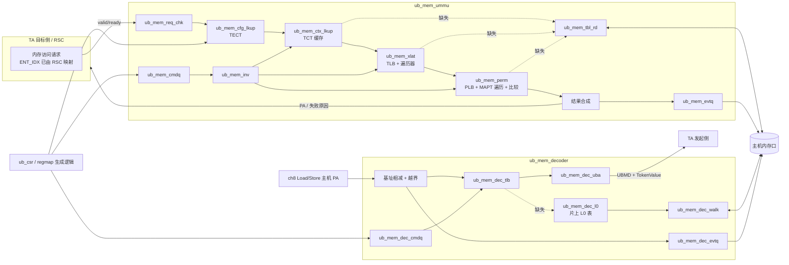

# 内存管理（第 9 章）微架构草案 — 线 C

| 项 | 值 |
| --- | --- |
| 作者 | 设计-C |
| 日期 | 2026-10-10（Asia/Shanghai） |
| 状态 | **草案**，不冻结端口。已作为 PR #23 提交 |
| 基准 | main `0a4a54d7`（SPEC §2.2 参数集固定网表、`<leaf>_<tag>` 命名）；D17–D19；PR #18（MODULE_INVENTORY / LAYER_CONTRACTS 草案）；PR #20（统一存储原语与具名后门，草案）；PR #21（原语参考模型与形式断言，草案） |
| 规范 | UB Base Spec Rev 2.0（D1）第 9 章，旁及 §7.2、§8.2、§8.3、§10.3、§11.4、§11.6、App. C.3.2、App. D.3.3、App. D.4.1 |
| 引用约定 | 只写章节号和项目自己的短句。本文件不含任何表项字段的比特位置、编码取值或规范原文。表项内部怎么切字段，只出现在「解码叶子」里，解码叶子的源码能否公开等船长决定（见 §11 D-01） |
| 提案标记 | 凡标「Xia 提案，待船长」的都是架构提案，规范没有裁定 |
| 修订 | 2026-10-10 18:07 按群内结论更新：阵列名、后门口名与 valid 后门、`EID_W`、原语端口、L0 表放置待船长 |

---

## 1. 范围与总体思路

1. 第 9 章的 TECT、TCT、MATT、MAPT 都是放在主机内存里的表。片上只放 **缓存** 和一张小的配置表，条目数全部是实现参数（§9.4 对片上结构没有要求）。
2. 两个功能体：
   - **Home 侧 UMMU**（§9.4）：输入一次内存访问的 UBMD 和访问属性，输出 PA、内存属性，或者失败原因。
   - **User 侧 UB 译码器**（§9.5）：输入主机 PA，输出 UBMD（EID、TokenID、UBA）和 TokenValue。
3. 页表（MATT）采用 Arm VMSAv8-64 Stage 1、4 KB 粒度、最多 4 级、48 bit 输入输出，含 5 处适配（§9.4.3 末段把格式交给实现；Xia 提案，待船长）。
4. **解码与结构分开**：每种规范表项有一个「解码叶子」，把原始表项拆成具名信号；所有「结构叶子」（缓存、流水线、遍历器）只认具名信号，不认比特位置。这样字段布局集中在少数几个文件里，结构叶子可以先写、先公开。
5. 规范表项尽量在 **写入或填充时** 解码，缓存里存的是解码后的信号束。查找关键路径上只剩译码器 L0 表一处需要现场解码（它按原始 64 B 存）。
6. 单时钟 `core_clk`（≈80.57 MHz，周期约 12.4 ns），叶子只接 `rst_pyc`，业务寄存器同步复位（`m.reset()`）。每个叶子只有一组参数；有多组参数时按 SPEC §2.2 出 `<leaf>_<tag>` 固定网表，生成的 Verilog 里不带 `parameter`。

## 2. 顶层框图

## 3. 叶子划分（对照 PR #18 MODULE_INVENTORY §7）

| PR #18 模块 | 本草案叶子 | 类型 | 职责（一句话） |
| --- | --- | --- | --- |
| `ub_mem_ummu` | `ub_mem_ummu` | 层次 | 例化下列叶子，对外一个查询口、一个表读口、一个表写口、一组 CSR |
| （新增） | `ub_mem_req_chk` | 结构 | 输入寄存、UBA 越界检查（等 TCTE 回来后做最终判定）、算各缓存下标 |
| `ub_mem_cfg_lkup` | `ub_mem_cfg_lkup` + `ub_mem_tecte_dec` | 结构 + 解码 | 按 ENT_IDX 读 TECT；TECT 由 CSR 写入，写入时经解码叶子转成信号束 |
| `ub_mem_ctx_lkup` | `ub_mem_ctx_lkup` + `ub_mem_tcte_dec` + `ub_mem_l1tct_dec` | 结构 + 解码 | TCT 缓存查找；缺失时读线性或两级 TCT，填充前解码 |
| `ub_mem_xlat` | `ub_mem_tlb` + `ub_mem_ptw` + `ub_mem_ptw_desc_dec` | 结构 + 解码 | 4 路组相联 TLB；VMSAv8-64 遍历器；块描述符拆成 4 KB 项填 TLB |
| `ub_mem_perm` | `ub_mem_plb` + `ub_mem_perm_walk` + `ub_mem_mapte_dec` + `ub_mem_perm_cmp` | 结构 + 解码 + 组合 | PLB 范围匹配；单项 / 多级 MAPT 遍历；TokenValue、排他位、访问类型比较与合成 |
| （新增） | `ub_mem_tbl_rd` | 结构 | UMMU 内部所有内存表读汇成一个 valid/ready 读口，按 tag 回送 |
| （新增） | `ub_mem_inv` | 结构 | 全部失效（一拍清 valid）、按条件扫描失效、SYNC |
| （新增） | `ub_mem_cmdq` / `ub_mem_evtq` | 结构 | UMMU 命令队列消费、事件记录写回（格式待后续批 Q-E09） |
| `ub_mem_decoder` | `ub_mem_decoder` | 层次 | 例化译码器叶子 |
| — | `ub_mem_dec_tlb` | 结构 | 按 1 MB 粒度缓存最终译码结果 |
| — | `ub_mem_dec_l0` | 结构 | 片上 L0 表（原始 64 B），只输出原始 512 bit 数据 |
| — | `ub_mem_dec_walk` | 结构 | L1 表读取（完整方案），只输出原始表项数据 |
| — | `ub_mem_dec_ent_dec` | 解码 | 在 `ub_mem_decoder` 这一层例化，接 `ub_mem_dec_l0` / `ub_mem_dec_walk` 的原始数据，输出 §5.5 信号束；选 PTE、比 PTRE 范围在其下游结构逻辑里做 |
| — | `ub_mem_dec_uba` | 组合 | 按 §9.5.2 由 UBA 基值与 PA 低位算 UBA |
| — | `ub_mem_dec_cmdq` / `ub_mem_dec_evtq` | 结构 | App. D.4.1 的 CMDQ / EVENTQ |
| `ub_mem_ubmd` | 并入解码叶子 | 解码 | UBMD 与各信号束的拆包只在设计侧解码叶子里；参考模型由 Xia 独立拆包，两边只共享 §5 的信号名和位宽（D17） |
| — | `ub_cmn_mem_1r1w_<tag>` | 原语 | 所有片上大表的存储本体（CODING_STYLE §10）。原语 RTL 由设计-B 在 PR #21 写；线 C 结构叶子先照 `model/ub_cmn_mem_1r1w.py` 的端口和时序写 |

EID→ENT_IDX 映射放在 RSC（Xia 答复 Q-A02），UMMU 只接 ENT_IDX 和「映射命中」位。

## 4. 叶子职责与接口概要

接口一律同时钟 valid/ready；带 `tag` 的口按 tag 回送。宽度用到的项目参数：`ENT_IDX_W=4`、`PA_W=48`、UBA 64 bit、TokenID 20 bit、TokenValue 32 bit（§7.2.3、§7.2.5）。

| 叶子 | 输入 | 输出 | 关键行为 |
| --- | --- | --- | --- |
| `ub_mem_ummu`（对外） | `ta2mem_q_*`：ENT_IDX、TokenID、UBA、长度不跨 4 KB、访问类型（读 / 写 / 原子）、TokenValue 有无与值、E_bit、EE_bits、请求属性 4 组、`tag` | `mem2ta_r_*`：PA、内存属性、MTM 边带 24 bit、成功 / 失败、失败原因 4 bit、`tag` | 1 查询 / 拍接收；命中按序返回；缺失时阻塞后续请求（首轮） |
| `ub_mem_req_chk` | 外部请求 | 流水 P0 寄存器；三个下标（TECT、TCT 缓存、TLB 组） | EE_bits 非 0 直接失败（首轮无 TEE） |
| `ub_mem_cfg_lkup` | ENT_IDX；CSR 写（经 `ub_mem_tecte_dec`） | 配置信号束（§5.1） | 读 1 拍；CSR 读回与查找共用读口，查找优先 |
| `ub_mem_ctx_lkup` | {ENT_IDX, TokenID}；填充数据（经 `ub_mem_tcte_dec`） | 上下文信号束（§5.2）、命中 / 缺失 | 直接映射；缺失时经 `ub_mem_tbl_rd` 读 64 B（两级多一次 8 B） |
| `ub_mem_tlb` | {ENT_IDX, TokenID, 页号}；填充；失效 | 翻译信号束（PFN、已解析的属性字节、页权限、AF）、命中 / 缺失 | 4 路并读、标签比较、伪 LRU 替换 |
| `ub_mem_ptw` | 上下文信号束、UBA | 填充项或翻译故障 | 由输入宽度推起始级，最多 4 次 8 B 读；块描述符拆成 4 KB 项 |
| `ub_mem_plb` | {ENT_IDX, TokenID}、UBA；填充；失效 | 权限信号束、命中 | 所有项并行比范围 |
| `ub_mem_perm_walk` | 上下文信号束、UBA | 权限信号束或 MAPT 故障 | 单项 1 次 32 B 读；多级 4 KB 最多 4 次 32 B 读，逐级比范围、看终止位 |
| `ub_mem_perm_cmp` | 权限信号束、请求的 TokenValue / E_bit / 访问类型、上下文排他位、页权限 | 通过 / 失败与原因 | 纯组合；§9.4.4.3.2–§9.4.4.3.5 |
| `ub_mem_tbl_rd` | 各遍历器请求 | `mem2host_rd_*`：地址 48 bit、长度 8 / 32 / 64 B、tag；响应 512 bit、tag、错误 | 固定优先级：TCT > 页表 > MAPT（首轮串行，只有一个未决） |
| `ub_mem_inv` | 命令或 CSR | 各缓存 valid 清除、扫描请求 | 见 §7 |
| `ub_mem_evtq` | 失败记录 | `mem2host_wr_*` | 队列满时置溢出标志、丢后续事件（等 Q-E09） |
| `ub_mem_decoder`（对外） | `fun2dec_q_*`：主机 PA 64 bit、`tag` | `dec2fun_r_*`：目标 EID（`EID_W` bit）、TokenID、UBA、TokenValue、属性、成功 / 失败、`tag` | 1 查询 / 拍 |
| `ub_mem_dec_l0` | PA 下标 | 原始 L0 大项 512 bit | 8 块并读；解码由 `ub_mem_decoder` 层例化的 `ub_mem_dec_ent_dec` 完成 |
| `ub_mem_dec_uba` | UBA 基值、PA 低位 | UBA 64 bit | 64 bit 加法，进位丢弃（Xia 答复 D-L09） |

## 5. 解码叶子 ↔ 结构叶子 具名信号契约

规则：

- 解码叶子的输入是一条原始表项（或 CSR 写入的规范格式镜像），输出是下面列出的具名信号；**比特位置只在解码叶子内部**。
- 「非法」类信号在解码叶子里算好：保留编码、首轮不支持的编码、指针高位越界，统一折成 `*_illegal` 加 `*_ill_cause`，结构叶子不看编码。
- 到达时间预算按优先顺序选：**(R) 解码叶子寄存输出，下游看到的是 0 拍组合**；(C) 组合输出，占周期的百分比上限。
- 宽度以 `PA_W=48` 为准；地址类信号按对齐去掉低位后的宽度给出。

### 5.1 `ub_mem_tecte_dec` → `ub_mem_cfg_lkup`（§9.4.2.1）

位置：CSR 写 TECT 的通路上，不在查找路径。

| 信号 | 位宽 | 含义 | 预算 |
| --- | --- | --- | --- |
| `cfg_v` | 1 | 表项有效 | R |
| `cfg_abort` | 1 | 软件设成「终止、不记事件」的翻译模式 | R |
| `cfg_illegal` | 1 | 配置非法（含不支持的合法编码），回错误并记事件（Q-A04 提案） | R |
| `cfg_ill_cause` | 3 | 非法原因细分（项目枚举） | R |
| `cfg_s1_en` | 1 | Stage 1 翻译开启 | R |
| `cfg_mem_attr` | 4 | 内存属性覆盖值 | R |
| `cfg_mem_attr_ovr` | 1 | 用覆盖值代替请求属性 | R |
| `cfg_sec_ovr_en` / `cfg_sec_ovr_val` | 1 / 1 | 安全属性覆盖开关与值 | R |
| `cfg_priv_ovr_en` / `cfg_priv_ovr_val` | 1 / 1 | 特权属性覆盖开关与值 | R |
| `cfg_inst_ovr_en` / `cfg_inst_ovr_val` | 1 / 1 | 指令 / 数据属性覆盖开关与值 | R |
| `cfg_mapt_en` | 1 | 本 Entity 允许权限检查 | R |
| `cfg_em_en` | 1 | 事件合并开关（首轮接受、不合并） | R |
| `cfg_tct_num` | 5 | TCT 项数的以 2 为底的对数 | R |
| `cfg_tct_2lvl` | 1 | 两级 TCT | R |
| `cfg_tct_ptr` | 42 | TCT 基址（64 B 对齐） | R |
| `cfg_mtm_from_ctx` | 1 | MTM 标识取自 TCTE | R |
| `cfg_mtm_id` / `cfg_mtm_gp` | 16 / 8 | 流量监测标识 | R |

信号束合计 **93 bit**，即 TECT 每项宽度。Stage 2 相关字段首轮不出信号（Stage 2 开启即 `cfg_illegal`）。

### 5.2 `ub_mem_tcte_dec` → `ub_mem_ctx_lkup`（§9.4.2.2.2）

位置：TCT 缓存填充通路上，不在命中路径。

| 信号 | 位宽 | 含义 | 预算 |
| --- | --- | --- | --- |
| `ctx_v` | 1 | 表项有效 | R |
| `ctx_illegal` / `ctx_ill_cause` | 1 / 4 | 配置非法与原因（首轮不支持的字节序、硬件标志更新、Stall、2 MB MAPT、MAC 模式、多块 MAPT、保留编码、指针越界等） | R |
| `ctx_oa_w` | 6 | 输出地址有效位数 | R |
| `ctx_ia_w` | 6 | UBA 有效位数（由规范的大小字段换算） | R |
| `ctx_affd` | 1 | AF 故障不报 | R |
| `ctx_fbr` | 1 | 翻译故障要记录 | R |
| `ctx_mapt_en` | 1 | 本上下文做权限检查 | R |
| `ctx_mapt_multi` | 1 | 多级 MAPT（0 = 单项） | R |
| `ctx_e_bit` | 1 | 上下文排他位 | R |
| `ctx_matt_wd` | 1 | 不遍历页表，TLB 缺失即记事件（Q-A08） | R |
| `ctx_mtm_id` / `ctx_mtm_gp` | 16 / 8 | 流量监测标识 | R |
| `ctx_matt_ba` | 44 | 页表基址（16 B 对齐） | R |
| `ctx_mapt_bba` | 43 | MAPT 基块地址（32 B 对齐） | R |
| `ctx_mapt_bb_sz` | 4 | MAPT 基块大小（以 4 KB 为单位的对数） | R |
| `ctx_mattr0` / `ctx_mattr1` | 32 / 32 | 两组属性字节，供页表属性索引选择 | R |

信号束合计 **203 bit**；加标签 {ENT_IDX, TokenID} 24 bit，TCT 缓存每项 **227 bit**。

### 5.3 `ub_mem_l1tct_dec` → `ub_mem_ctx_lkup`（§9.4.2.2.3）

| 信号 | 位宽 | 含义 | 预算 |
| --- | --- | --- | --- |
| `l1tct_v` | 1 | 描述符有效 | R |
| `l1tct_illegal` | 1 | 指针越界 | R |
| `l1tct_l2_ptr` | 36 | L2 TCT 基址（4 KB 对齐） | R |

### 5.4 `ub_mem_mapte_dec` → `ub_mem_perm_walk` / `ub_mem_plb`（§9.4.4.2.2、§9.4.4.2.3）

单项与多级共用一个解码叶子，输入多一个「级别 / 模式」选择。位置：MAPT 遍历通路上，每读回一项解码一次。

| 信号 | 位宽 | 含义 | 预算 |
| --- | --- | --- | --- |
| `mapte_v` | 1 | 表项有效 | R |
| `mapte_last` | 1 | 本项不再指向下一级（单项模式恒为 1） | R |
| `mapte_next_other_blk` | 1 | 下一级在其他块（首轮视为非法） | R |
| `mapte_e_bit` | 1 | 排他位 | R |
| `mapte_perm_w` / `mapte_perm_r` / `mapte_perm_a` | 1 / 1 / 1 | 写 / 读 / 原子许可 | R |
| `mapte_token_chk` | 1 | 需要比 TokenValue | R |
| `mapte_base` / `mapte_limit` | 48 / 48 | 范围起止（按级零扩展；闭区间，Q-A14） | R |
| `mapte_next_off` | 30 | 下一级相对块基址的字节偏移 | R |
| `mapte_next_idx` | 16 | 下一级所在块的块表下标（首轮不用） | R |
| `mapte_tv0` / `mapte_tv1` | 32 / 32 | 两个 TokenValue | R |

合计 **214 bit**。

### 5.5 `ub_mem_dec_ent_dec`（`ub_mem_decoder` 层例化，输入为 `ub_mem_dec_l0` / `ub_mem_dec_walk` 的原始数据）→ 译码器结构逻辑（§9.5.1）

L0 PTE、L0 PTRE、L1 PTE 的格式规范没有给出，由项目自定（Xia 提案，待船长）。下表是数据通路需要的解包信号，宽度里标「待」的随格式定。

| 信号 | 位宽 | 含义 | 预算 |
| --- | --- | --- | --- |
| `dent_is_range` | 1 | 64 B 大项是范围项（否则是 8 个页表项） | **C ≤ 30%**（L0 表按原始存储，读出后现场解码；内容只是选位和一个小比较，实际远低于 30%） |
| `dent_pte_v` | 1 | 选中的 L0 页表项有效（由 PA 的 3 bit 选） | C ≤ 30% |
| `dent_rng_v` | 1 | 范围项有效 | C ≤ 30% |
| `dent_rng_base` / `dent_rng_limit` | 15 / 15 | 范围（与 PA[34:20] 比） | C ≤ 30% |
| `dent_rng_last` | 1 | 范围项本身是最后一级（Xia 提案，待船长） | C ≤ 30% |
| `dent_l1_base` | 36（待） | L1 表基址（暂按 4 KB 对齐） | C ≤ 30% |
| `dent_eid` | `EID_W`（第一波 20） | 目标 EID。`EID_W` 是叶子参数；128 bit 将来按 SPEC §2.2 出 `_eid128` 变体（待船长） | C ≤ 30%，下游先寄存 |
| `dent_token_id` | 20 | TokenID | 同上 |
| `dent_token_value` | 32 | TokenValue | 同上 |
| `dent_uba_base` | 52 | UBA 基值（§9.5.2） | 同上 |
| `dent_attr` | 8（待） | 其他相关属性 | 同上 |

译码结果束（EID + TokenID + TokenValue + UBA 基值 + 属性）= **112 + `EID_W` bit**，第一波 `EID_W=20` 时 132 bit；`_eid128` 变体为 240 bit。L1 表项走同一解码叶子，读回后先寄存（预算 R）。

### 5.6 `ub_mem_ptw_desc_dec` → `ub_mem_ptw`（VMSAv8-64 描述符，§9.4.3 末段）

格式来自所选体系结构，不来自 UB 规范。

| 信号 | 位宽 | 含义 | 预算 |
| --- | --- | --- | --- |
| `desc_v` | 1 | 描述符有效 | R |
| `desc_kind` | 2 | 表 / 块 / 页 / 保留 | R |
| `desc_addr` | 36 | 下一级表或输出页地址（4 KB 对齐） | R |
| `desc_attr_idx` | 3 | 属性索引 | R |
| `desc_ap` | 2 | 访问许可 | R |
| `desc_uxn` / `desc_pxn` | 1 / 1 | 执行禁止（按适配第 3 条使用） | R |
| `desc_af` | 1 | 访问标志 | R |

合计 47 bit。遍历器在填 TLB 前把属性索引换成属性字节（从 `ctx_mattr0/1` 里选），TLB 里只存解析后的 8 bit。

## 6. 查表流水线与旁路

### 6.1 UMMU 命中路径（3 拍）

| 拍 | 做什么 |
| --- | --- |
| P0 | 请求寄存。算三个下标：TECT 用 ENT_IDX；TCT 缓存用 TokenID 低 6 位与 ENT_IDX 混合；TLB 组用 UBA 页号低 6 位与 TokenID 低 6 位混合。**三处同拍发读**，互不依赖。PLB 是触发器，在 P0 就开始并行比范围 |
| P1 | 三处读数据到（原语寄存输出）。写后读旁路选择。TCT 标签比较、4 路 TLB 标签比较、命中路选择。配置 / 上下文检查（都是解码时算好的单比特）、UBA 是否超出有效位数、上下文排他位。PLB 命中选择 |
| P2 | `ub_mem_perm_cmp`：TokenValue 两值比较、MAPT 排他位、访问类型、页权限合成；按 §9.4.4.3.5 选失败类别；输出寄存 |

关键路径：**P1**，即原语读出 → 60 bit 标签比较 ×4 → 4 选 1（49 bit）→ 命中合成。80.57 MHz 下余量较大；工艺代理（Sky130）快速综合后再定要不要把标签比较和数据选择拆成两拍。

### 6.2 UMMU 缺失路径

- 首轮 **阻塞式**：一次只处理一个缺失，后续请求在 P0 停住（ready=0）。
- 顺序：TCT 缓存缺失 → 读 TCTE（两级多一次）→ 填充；TLB 缺失且未禁止遍历 → 页表遍历最多 4 次 → 填充；需要权限检查且 PLB 缺失 → MAPT 遍历最多 4 次 → 填 PLB。所有表读走 `ub_mem_tbl_rd` 一个口。
- 填充完成后从 P0 **重放** 该请求，命中路径给出结果，保证结果只有一条产生通路。
- §9.4.3 图示里权限检查与地址翻译可以并行；首轮因只有一个表读口而串行，以后加第二个未决请求时再交错。

### 6.3 写后读旁路

原语同拍同址读写返回旧值（CODING_STYLE §10，PR #20）。每个原语实例外包一层旁路：本拍 `we && re && waddr == raddr` 时把 `wdata` 寄存一拍，P1 用它替换 `rdata`。写后下一拍再读已经是新值，不需要更长的旁路。重放机制下这种同拍冲突主要出现在「填充与另一请求的查找同拍」时。

### 6.4 译码器命中路径（4 拍，按 L0 片上方案写）

L0 表放片上还是放内存待船长决定（见 §11 D-14）。放内存时 D1 只读翻译缓存，缺失走 `ub_mem_dec_walk` 先读 L0 再读 L1，命中路径不变。

| 拍 | 做什么 |
| --- | --- |
| D0 | 主机 PA 减 MMIO 基址（64 bit），与窗口大小比越界（App. D.4.1.5） |
| D1 | 译码翻译缓存读（以 PA[43:20] 为标签）；片上 L0 表读（PA[43:35] 下标，8 块并读） |
| D2 | 翻译缓存命中则取结果；否则对 L0 读出现场解码：页表项用 PA[34:32] 选；范围项与 PA[34:20] 比。范围命中且是最后一级 → 得结果束；其余情形转 L1（完整方案）或回错误（最小表方案）。结果束寄存 |
| D3 | `ub_mem_dec_uba` 64 bit 加法；输出寄存 |

L1 路径：页表项情形用 PA[31:20] 下标（每张 4096 项），范围项未命中或非最后一级用 PA[34:20] 下标（32768 项）；读回经解码叶子寄存，再回到 D3。结果填译码翻译缓存（1 MB 粒度）。

## 7. 失效机制

| 动作 | 做法 | 依据 |
| --- | --- | --- |
| 全部失效 | 各缓存 valid（原语外的复位触发器）一拍清 | Xia 答复 Q-C09 |
| 按 ENT_IDX / TokenID 失效 | 逐组读原语里的标签比较、清 valid；TLB 64 拍、TCT 缓存 64 拍、PLB 1 拍（触发器并比）；扫描期间查找口 ready=0 | Q-C09；§11.4.4 按组失效 |
| SYNC | 等此前所有命令生效、无未决缺失，写一条完成事件 | Q-C09 |
| TokenValue 变化 | PLB 命中但 TokenValue 不符时作废该项，重走 MAPT 再比一次（§9.4.4.3.2 注的做法） | Q-C04 |
| CSR 改 TECT | 不自动失效下游缓存，由软件发失效命令 | Q-C09 |
| 译码器 | 全部失效、按 PA 范围失效、SYNC（Xia 提案，待船长）；范围失效扫描译码翻译缓存 32 拍 | App. D.4.1.7–D.4.1.10；Q-B08 |
| 删段前排空 | 由 FUN / 软件保证；UMMU 只给全局空闲位 | §8.2.1.1；后续批 Q-E06 |

## 8. 错误与事件通路

- **返回请求方**：每个查询返回成功或失败，失败带 4 bit 原因枚举（项目自定）：配置无效、配置终止（不记事件）、配置非法、TokenID 越界、上下文无效、上下文排他拒绝、UBA 越界、翻译遍历故障、AF 故障、页权限拒绝、MAPT 表项无效、MAPT 范围失败、TokenValue 失败、MAPT 排他拒绝、访问类型拒绝、表读错误。映射到 TAACK 状态和 RAS 错误类别等后续批 Q-E02。
- **记事件**：除「配置终止」外都记；翻译遍历故障和 AF 故障受上下文的记录位控制，其余规范要求记事件的情形始终记（Q-A19 提案）。首轮不合并事件。
- **事件写回**：`ub_mem_evtq` 打包事件记录，经表写口写入内存队列；队列满置溢出标志。UMMU 事件格式和寄存器切片待 Q-E09；译码器事件格式按 Xia Q-B08 提案。
- **中断**：译码器按 App. D.4.1.6 的向量号上报；UMMU 中断接 RSC（ch10），待 RSC 契约。
- **错误优先级**：一次查询同时命中多种失败时报哪一个，规范没写，**待定**（见 §11）。草案暂按流水先后：配置 → 上下文 → 越界 → 翻译 → 权限。

## 9. 必选 / 可选特性边界

| 特性 | 规范性质 | 首轮 | 说明 |
| --- | --- | --- | --- |
| 配置查找、上下文查找、Stage 1 翻译、错误与事件 | 必选（支持 Stage 1 时） | 做 | §9.4.2、§9.4.3 |
| 线性 TCT、两级 TCT | 两种格式都已定义 | 都做 | §9.4.2.2 |
| 权限检查（MAPT） | 整体为 MAY；做了就按 SHALL 规则 | 做 | §9.4.4.1 |
| 单项 MAPT、多级 MAPT 4 KB、只用基块 | 定义内 | 做 | §9.4.4.2 |
| 多级 MAPT 2 MB | 规范未写成可选 | **延后，需船长明确接受** | Q-A17 |
| 硬件更新访问 / 脏标志 | 规范未写成可选 | **延后，需船长明确接受** | Q-A18 |
| 多块 MAPT | 定义内 | 延后 | Q-A16 |
| Stage 2、安全态 Stage 2 | 能力可选 | 延后 | Q-A03 |
| Stall | 依赖处理器能力 | 延后 | Q-A19 |
| 事件合并 | MAY | 接受配置、不合并 | Q-A20 |
| 流量监测 | 定义内；计数内容第 9 章未定义 | 只透传标识 | Q-A21 |
| PLB / Positive PLB | 只在注里出现 | 做小 PLB；不做免失效优化 | Q-C04 |
| 不遍历页表模式 | 定义内 | 按字面做（缺失即记事件），无软件预装口 | Q-A08 |
| TEE（EE_bits 选表） | ch11 可选 | 延后，EE_bits 非 0 回错误 | §11.6.4；Q-E03 |
| 委托非特权软件管 MAPT | MAY | 硬件只做块大小内访问 | §9.4.4.1；Q-E12 |
| 译码器（总线控制器） | User 侧 Load/Store 必需 | 先最小表（L0 片上 / 内存待船长），交付前补完整版 | §9.5；App. C.3.2；Q-B11 |

D19 第 3 条：可选功能集中在最后一轮。

## 10. 大表项表

存储本体一律例化 `ub_cmn_mem_1r1w`，按 SPEC §2.2 每种 深度×宽度 出一份固定网表 `ub_cmn_mem_1r1w_d<DEPTH>w<WIDTH>[m<WMASK_W>]`。表项有效位放原语外的复位触发器（`valid_outside`），这些实例的 `ASSERT_NO_UNINIT_READ=0`。时序：寄存输出读 1 拍、1R1W、同址读旧值，叶子内做写后读旁路。原语端口照 `model/ub_cmn_mem_1r1w.py`：`we/waddr/wdata`、`re/raddr/rdata`；时钟口统一叫 `core_clk`。原语没有复位口；阵列与 `rdata` 都不复位。`rst_pyc` 只用于结构叶子和原语外的 valid 触发器。

后门口统一 `tb_<inst>_bd_*`：预装 `tb_<inst>_bd_we/addr/wdata`、读出 `tb_<inst>_bd_re/rdata`；valid 位在原语外的复位触发器里，预装时由 `tb_<inst>_bd_vld_*` 同拍一起写。全部只在 HOOKS 网表，受 `tb_test_mode` 门控，eqy 时 `tb_test_mode=0`、后门输入接低。后门清单只含下表「测试钩子需求」列出 `tb_*` 的阵列；PLB 等触发器结构不进清单。

| 表名（inst） | 深度 | 位宽（总） | 端口形式 | 每拍访问次数 | 关键路径 | 触发器 / SRAM 初判 | 测试钩子需求 | 参数待 Xia 确认 |
| --- | --- | --- | --- | --- | --- | --- | --- | --- |
| TECT（`mem_cfg`） | 16 | 93 | 原语 1R1W `ub_cmn_mem_1r1w_d16w93`；CSR 读回与查找共用读口 | 读 ≤1（查找优先），写 ≤1（CSR） | 否（字段已在写入时解码） | 原语（CODING_STYLE §10 点名）；1,488 bit，后端可映射成触发器 | `tb_mem_cfg_bd_*` + `tb_mem_cfg_bd_vld_*` | 深度 16（Q-A02/Q-C01，待船长）；宽度随 §5.1 |
| TCT 缓存（`mem_tct`） | 64 | 227 | 原语 1R1W `ub_cmn_mem_1r1w_d64w227`，直接映射 | 读 ≤1（查找或扫描），写 ≤1（填充） | 是（P1 标签比较） | SRAM；14,528 bit | `tb_mem_tct_bd_*` + `tb_mem_tct_bd_vld_*` | `TCT_CACHE_DEPTH`、直接映射 |
| L1 TCT 描述符缓存 | 8 | 54 | 触发器，全相联 | 读 1（并比），写 ≤1 | 否（只在缺失路径） | 触发器；432 bit | 不需要 | 深度 8 |
| TLB 第 0～3 路（`mem_tlb_w0`～`mem_tlb_w3`） | 64 ×4 | 109 | 每路一个原语 1R1W `ub_cmn_mem_1r1w_d64w109`，4 路同拍并读 | 每路读 1；写 ≤1（只写替换路） | **是，最关键**（4 路 60 bit 比较 + 4 选 1） | SRAM；27,904 bit | 每路 `tb_mem_tlb_wN_bd_*` + `tb_mem_tlb_wN_bd_vld_*` | `TLB_SETS`、`TLB_WAYS` |
| TLB valid + 伪 LRU | 256 + 64 | 1 + 3 | 复位触发器 | 读 4 / 写 ≤4 | 是（与标签比较同拍） | 触发器；448 bit | valid 经各路 `tb_mem_tlb_wN_bd_vld_*` 写；伪 LRU 不需要 | 随 TLB |
| PLB | 4 | 227 | 复位触发器，全相联范围匹配 | 读 4（并比），写 ≤1 | 是（范围比较在 P0–P1） | 触发器；908 bit。不用原语（要每项并行比） | 不进后门清单 | `PLB_DEPTH` |
| 译码 L0 表（`mem_dec_b0`～`mem_dec_b7`；片上方案） | 512 ×8 块 | 64 | 8 个原语 1R1W `ub_cmn_mem_1r1w_d512w64`，同拍并读 | 读：8 块各 1；写 ≤1 块（CSR / 命令每拍写 64 bit） | 是（读出后现场解码 + 15 bit 范围比较） | SRAM；262,144 bit，全线 C 最大。放片上还是内存待船长（D-14） | 每块 `tb_mem_dec_bN_bd_*` + `tb_mem_dec_bN_bd_vld_*` | 放置方案、宏可用性（PR #9 工艺） |
| 译码 L0 表备选（`mem_dec_l0`，片上方案） | 512 | 512 | 1 个原语 `ub_cmn_mem_1r1w_d512w512m64`（`WMASK_W=64`，按 64 bit 分段写，同拍同地址各段读旧值） | 读 1（整行 512 bit），写 ≤1 段 | 同上 | SRAM；262,144 bit；单块宏密度优于 8 块小宏（实现建议）。设计-B 已确认 PR #21 出 `WMASK_W` 分段写 | `tb_mem_dec_l0_bd_*` + `tb_mem_dec_l0_bd_vld_*`（宽 8 位）；有效位按段放在原语外，每行 8 位，与模型按段的 `rdata_valid` 一一对应；选用此方案时 SPEC §10 由 8 块改登记为单个阵列 `mem_dec_l0` | 同上 + 原语分段写 |
| 译码翻译缓存（`mem_dec_tlb`） | 32 | 158 | 原语 1R1W `ub_cmn_mem_1r1w_d32w158` | 读 ≤1，写 ≤1 | 中（D1–D2） | 原语；5,056 bit（`_eid128` 变体每项 266 bit，8,512 bit） | `tb_mem_dec_tlb_bd_*` + `tb_mem_dec_tlb_bd_vld_*` | `DEC_TLB_DEPTH`；`EID_W` |
| UMMU / 译码器 命令预取 FIFO | 4 ×2 | 128 | 触发器 FIFO | 读 ≤1，写 ≤1 | 否 | 触发器；1,024 bit | 不需要 | 命令格式（Q-B08、Q-E09） |
| UMMU / 译码器 事件 FIFO | 8 ×2 | 256 | 触发器 FIFO | 读 ≤1，写 ≤1 | 否 | 触发器；4,096 bit | 不需要（水位可经 CSR 读） | 事件格式（Q-B08、Q-E09） |

合计：原语类约 **31.1 万 bit**（其中译码 L0 表 26.2 万）；触发器类约 6.9 千 bit。若船长定 L0 放内存，原语类降到约 4.9 万 bit。

## 11. 待决事项

| 编号 | 事项 | 影响 | 去向 |
| --- | --- | --- | --- |
| D-01 | 解码叶子里的字段切片常量能否进公开仓库（Xia 答复 0.4 第 8 项） | 解码叶子能否入库；不定则只能本机生成、生成物不入库 | 船长 |
| D-02 | EID→ENT_IDX 映射与 TECT 下标方式（Q-A02） | UMMU 输入口；RSC 契约 | 船长；LAYER_CONTRACTS §5/§6 |
| D-03 | MAPT 基址是否也要做 Stage 2 | 只影响 Stage 2 轮 | Xia（Stage 2 开工前） |
| D-04 | 一次查询多种失败时的报错优先级 | `ub_mem_perm_cmp` 结果选择、事件内容 | Xia |
| D-05 | 译码器 L0 PTE / PTRE / L1 PTE 由项目自定的格式，含 PTRE「最后一级」位 | §5.5 宽度标「待」各项、翻译缓存宽度 | 船长 |
| D-06 | 128 bit EID 的 `_eid128` 变体是否需要、何时出（第一波已定 `EID_W=20`） | 译码结果束、翻译缓存宽度（+108 bit/项） | 船长 |
| D-07 | **关闭**：阵列名定为 `mem_tlb_w0..w3`、`mem_dec_b0..b7`、`mem_dec_tlb`，删去 `mem_matt` / `mem_mapt`；PLB 用触发器、不进后门清单 | — | 已定（群内结论） |
| D-08 | **关闭**：原语时钟口统一 `core_clk`；原语没有复位口（阵列与 `rdata` 都不复位）；`rst_pyc` 只用于结构叶子和原语外 valid 触发器 | — | 已定（群内结论）；PR #21 原语 RTL 按此写 |
| D-09 | **更新**：原语 RTL 由设计-B 在 PR #21 写；线 C 先照 `model/ub_cmn_mem_1r1w.py` 的端口和时序写结构叶子，原语合入后再联调 | 联调时间点 | PM 排期（跟踪 PR #21） |
| D-10 | **关闭**：valid 位在原语外复位触发器，后门预装时由 `tb_<inst>_bd_vld_*` 一起写，仅 HOOKS、`tb_test_mode` 门控 | — | 已定（群内结论）；需写进 SPEC §10 例外小节与门禁钩子端口表 |
| D-11 | UMMU 表写口（事件写回）与表读口如何与 FUN/TA 共享内存口 | 顶层端口 | 后续批 Q-C07 / Q-E07 |
| D-12 | UMMU 命令、事件格式与寄存器切片 | `ub_mem_cmdq`、`ub_mem_evtq`、regmap.yaml | 后续批 Q-E09 |
| D-13 | 关键路径是否要拆拍 | 命中延迟 3 拍或 4 拍 | 后端快速综合（Sky130 代理）后定 |
| D-14 | 译码 L0 表放片上（8 块 512×64，或备选 1 块 512×512 分段写）还是放内存（只留翻译缓存） | 原语总量 31.1 万 / 4.9 万 bit；Sky130 代理面积片上约 0.18 mm²（计小宏外围约 0.25–0.35 mm²），放内存约 0.033 mm²，约 6:1（实现估算） | 船长 |

## 12. 依赖的「Xia 提案，待船长确认」项

| Xia 答复条目 | 内容 | 本草案用在哪 |
| --- | --- | --- |
| Q-A11 | 页表采用 VMSAv8-64 4 KB Stage 1，含 5 处适配（{ENT_IDX, TokenID} 充当 ASID；块描述符拆成 4 KB TLB 项；原子按写权限判；请求无特权 / 指令属性时用 TECTE 覆盖值或默认值；表遍历属性固定） | §5.6、§6.2、TLB 结构 |
| Q-A04 | 合法但不支持的编码回错误并记事件 | §5.1、§5.2 `*_illegal`；§8 |
| Q-A08 | 不遍历页表模式：TLB 缺失即记事件 | §5.2 `ctx_matt_wd`；§6.2 |
| Q-A03、A16–A20 | 首轮范围缩减（Stage 1、只用基块、4 KB MAPT、无硬件标志更新、无 Stall、不合并事件）；其中 2 MB MAPT 与硬件标志更新规范未写成可选 | §9 |
| Q-A02、Q-C01 | ENT_IDX 16 项、片上 TECT、CSR 写入 | TECT 行 |
| Q-A10、Q-B02、Q-B07 | `PA_W=48`、44 bit 译码空间、按总线控制器实现 | 全部宽度；§6.4 |
| Q-A14、Q-A15 | MAPT 范围闭区间只比本级有效位；UBA 有效位数合法范围与越界处理 | §5.4；§6.1 |
| Q-C02～C06 | 各缓存条目数 | §10 |
| Q-C08 | 原语时序（寄存读 1 拍、1R1W、同址读旧值） | §6.3；§10 |
| Q-C09 | 失效方式、无延迟上限、SYNC 后生效 | §7 |
| Q-C10 | 大存储阵列后门例外 | §10 钩子列 |
| Q-B08、Q-B11 | 译码器命令 / 事件格式；最小表方案 | §6.4；§7；§10 |
| 群内结论（EID） | 第一波 `EID_W=20`；`_eid128` 变体待船长 | §4；§5.5；§10 |
| Xia 缺图核定（译码器部分） | 译码器三种表项格式由项目自定；PTRE 加「最后一级」位 | §5.5；§6.4 |
